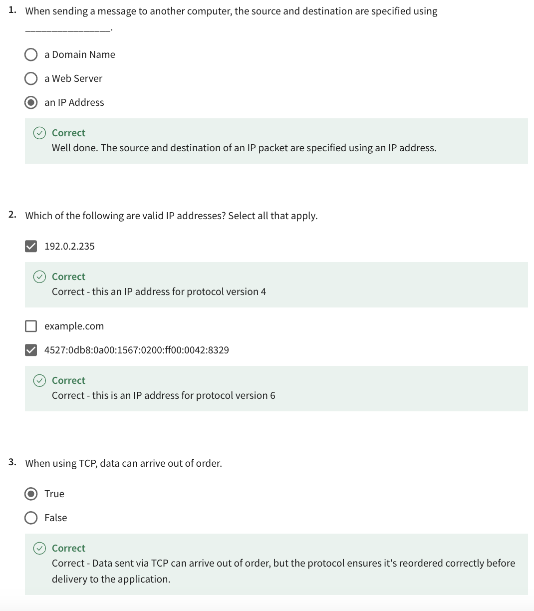

- [Quizzes](#quizzes)
  - [Module 1](#module-1)
    - [Knowledge Check - How the web works](#knowledge-check---how-the-web-works)
    - [Knowledge Check - The Web and the Internet](#knowledge-check---the-web-and-the-internet)
    - [Knowledge Check - Core Internet Technologies](#knowledge-check---core-internet-technologies)
    - [Module Quiz: Get started with Web Development](#module-quiz-get-started-with-web-development)
  - [Module 2](#module-2)
    - [Module Quiz: Introduction to HTML and CSS](#module-quiz-introduction-to-html-and-css)
  - [Module 3](#module-3)
    - [Module Quiz: UI Frameworks](#module-quiz-ui-frameworks)
  - [Module 4](#module-4)
    - [Course 1 Assessment: Introduction to Web Development](#course-1-assessment-introduction-to-web-development)
- [Other Internet Protocols](#other-internet-protocols)
  - [Dynamic Host Configuration Protocol (DHCP)](#dynamic-host-configuration-protocol-dhcp)
  - [Domain Name System Protocol (DNS)](#domain-name-system-protocol-dns)
  - [Internet Message Access Protocol (IMAP)](#internet-message-access-protocol-imap)
  - [Simple Mail Transfer Protocol (SMTP)](#simple-mail-transfer-protocol-smtp)
  - [Post Office Protocol (POP)](#post-office-protocol-pop)
  - [File Transfer Protocol (FTP)](#file-transfer-protocol-ftp)
  - [Secure Shell Protocol (SSH)](#secure-shell-protocol-ssh)
  - [SSH File Transfer Protocol (SFTP)](#ssh-file-transfer-protocol-sftp)
- [HTTP examples](#http-examples)
  - [Request Line](#request-line)
  - [HTTP Methods](#http-methods)
  - [HTTP Request Headers](#http-request-headers)
  - [HTTP Request Body](#http-request-body)
  - [HTTP Responses](#http-responses)
  - [HTTP Status Codes](#http-status-codes)
  - [HTTP Response Headers](#http-response-headers)
  - [HTTP Response Body](#http-response-body)

# Quizzes

## Module 1

### Knowledge Check - How the web works


### Knowledge Check - The Web and the Internet




### Knowledge Check - Core Internet Technologies


### Module Quiz: Get started with Web Development


## Module 2

### Module Quiz: Introduction to HTML and CSS


## Module 3

### Module Quiz: UI Frameworks


## Module 4

### Course 1 Assessment: Introduction to Web Development


# Other Internet Protocols

## Dynamic Host Configuration Protocol (DHCP)

You've learned that computers need IP addresses to communicate with each other. When your computer connects to a network, the Dynamic Host Configuration Protocol or DHCP as it is commonly known, is used to assign your computer an IP address.

Your computer communicates over User Datagram Protocol (UDP) using the protocol with a type of server called a DHCP server. The server keeps track of computers on the network and their IP addresses. It will assign your computer an IP address and respond over the protocol to let it know which IP address to use. Once your computer has an IP address, it can communicate with other computers on the network.

## Domain Name System Protocol (DNS)

Your computer needs a way to know with which IP address to communicate when you visit a website in your web browser, for example, `meta.com`. The Domain Name System Protocol, commonly known as DNS, provides this function. Your computer then checks with the DNS server associated with the domain name and then returns the correct IP address.

## Internet Message Access Protocol (IMAP)

Do you check your emails on your mobile or tablet device? Or maybe you use an email application on your computer?

Your device needs a way to download emails and manage your mailbox on the server storing your emails. This is the purpose of the Internet Message Access Protocol or IMAP.

## Simple Mail Transfer Protocol (SMTP)

Now that your emails are on your device, you need a way to send emails. The Simple Mail Transfer Protocol, or SMTP, is used. It allows email clients to submit emails for sending via an SMTP server. You can also use it to receive emails from an email client, but IMAP is more commonly used.

## Post Office Protocol (POP)

The Post Office Protocol (POP) is an older protocol used to download emails to an email client. The main difference in using POP instead of IMAP is that POP will delete the emails on the server once they have been downloaded to your local device. Although it is no longer commonly used in email clients, developers often use it to implement email automation as it is a more straightforward protocol than IMAP.

## File Transfer Protocol (FTP)

When running your websites and web applications on the Internet, you'll need a way to transfer the files from your local computer to the server they'll run on. The standard protocol used for this is the File Transfer Protocol or FTP. FTP allows you to list, send, receive and delete files on a server. Your server must run an FTP Server and you will need an FTP Client on your local machine. You'll learn more about these in a later course.

## Secure Shell Protocol (SSH)

When you start working with servers, you'll also need a way to log in and interact with the computer remotely. The most common method of doing this is using the Secure Shell Protocol, commonly referred to as SSH. Using an SSH client allows you to connect to an SSH server running on a server to perform commands on the remote computer.

All data sent over SSH is encrypted. This means that third parties cannot understand the data transmitted. Only the sending and receiving computers can understand the data.

## SSH File Transfer Protocol (SFTP)

The data is transmitted insecurely when using the File Transfer Protocol. This means that third parties may understand the data that you are sending. This is not right if you transmit company files such as software and databases. To solve this, the SSH File Transfer Protocol, alternatively called the Secure File Transfer Protocol, can be used to transfer files over the SSH protocol. This ensures that the data is transmitted securely. Most FTP clients also support the SFTP protocol.

# HTTP examples

## Request Line

Every HTTP request begins with the request line.

This consists of the HTTP method, the requested resource and the HTTP protocol version.

`GET /home.html HTTP/1.1`

In this example, `GET` is the HTTP method, `/home.html` is the resource requested and HTTP 1.1 is the protocol used.

## HTTP Methods

HTTP methods indicate the action that the client wishes to perform on the web server resource.

Common HTTP methods are:

| HTTP Method | Description                                              |
| ----------- | -------------------------------------------------------- |
| GET         | The client requests a resource on the web server.        |
| POST        | The client submits data to a resource on the web server. |
| PUT         | The client replaces a resource on the web server.        |
| DELETE      | The client deletes a resource on the web server.         |

## HTTP Request Headers

After the request line, the HTTP headers are followed by a line break.

There are various possibilities when including an HTTP header in the HTTP request. A header is a case-insensitive name followed by a: and then followed by a value.

Common headers are:

```
Host: example.com​
User-Agent: Mozilla/5.0 (Macintosh; Intel Mac OS X 10.9; rv:50.0) Gecko/20100101 Firefox/50.0
Accept: */*
Accept-Language: en​
Content-type: text/json
```

- The `Host` header specifies the host of the server and indicates where the resource is requested from.

- The `User-Agent` header informs the web server of the application that is making the request. It often includes the operating system (Windows, Mac, Linux), version and application vendor.

- The `Accept` header informs the web server what type of content the client will accept as the response.

- The `Accept-Language` header indicates the language and optionally the locale that the client prefers.

- The `Content-type` header indicates the type of content being transmitted in the request body.

## HTTP Request Body

HTTP requests can optionally include a request body. A request body is often included when using the HTTP POST and PUT methods to transmit data.

```
POST /users HTTP/1.1​
Host: example.com​

{
 "key1":"value1",​
 "key2":"value2",​
 "array1":["value3","value4"]
}
```

```
PUT /users/1 HTTP/1.1
Host: example.com
Content-type: text/json

{"key1":"value1"}
```

## HTTP Responses

When the web server is finished processing the HTTP request, it will send back an HTTP response.

The first line of the response is the status line. This line shows the client if the request was successful or if an error occurred.

`HTTP/1.1 200 OK​`

The line begins with the HTTP protocol version, followed by the status code and a reason phrase. The reason phrase is a textual representation of the status code.

## HTTP Status Codes

The first digit of an HTTP status code indicates the category of the response: Information, Successful, Redirection, Client Error or Server Error.

The common status codes you'll encounter for each category are:

_1XX Informational_

| Status Code | Reason Phrase       | Description                                                                                 |
| ----------- | ------------------- | ------------------------------------------------------------------------------------------- |
| 100         | Continue            | The server received the request headers and should continue to send the request body.       |
| 101         | Switching Protocols | The client has requested the server to switch protocols and the server has agreed to do so. |

_2XX Successful_

| Status Code | Reason Phrase | Description                                                                                   |
| ----------- | ------------- | --------------------------------------------------------------------------------------------- |
| 200         | OK            | Standard response returned by the server to indicate it successfully processed the request.   |
| 201         | Created       | The server successfully processed the request and a resource was created.                     |
| 202         | Accepted      | The server accepted the request for processing but the processing has not yet been completed. |
| 204         | No Content    | The server successfully processed the request but is not returning any content.               |

_3XX Redirection_

| Status Code | Reason Phrase     | Description                                                                   |
| ----------- | ----------------- | ----------------------------------------------------------------------------- |
| 301         | Moved Permanently | This request and all future requests should be sent to the returned location. |
| 302         | Found             | This request should be sent to the returned location.                         |

_4XX Client Error_

| Status Code | Reason Phrase      | Description                                                                                                                                                                                                                                |
| ----------- | ------------------ | ------------------------------------------------------------------------------------------------------------------------------------------------------------------------------------------------------------------------------------------ |
| 400         | Bad Request        | The server cannot process the request due to a client error, e.g., invalid request or transmitted data is too large.                                                                                                                       |
| 401         | Unauthorized       | The client making the request is unauthorized and should authenticate.                                                                                                                                                                     |
| 403         | Forbidden          | The request was valid but the server is refusing to process it. This is usually returned due to the client having insufficient permissions for the website, e.g., requesting an administrator action but the user is not an administrator. |
| 404         | Not Found          | The server did not find the requested resource.                                                                                                                                                                                            |
| 405         | Method Not Allowed | The web server does not support the HTTP method used.                                                                                                                                                                                      |

_5XX Server Error_

| Status Code | Reason Phrase         | Description                                                                                                    |
| ----------- | --------------------- | -------------------------------------------------------------------------------------------------------------- |
| 500         | Internal Server Error | A generic error status code given when an unexpected error or condition occurred while processing the request. |
| 502         | Bad Gateway           | The web server received an invalid response from the Application Server.                                       |
| 503         | Service Unavailable   | The web server cannot process the request.                                                                     |

## HTTP Response Headers

Following the status line, there are optional HTTP response headers followed by a line break.

Similar to the request headers, there are many possible HTTP headers that can be included in the HTTP response.

Common response headers are:

```
Date: Fri, 11 Feb 2022 15:00:00 GMT+2​
Server: Apache/2.2.14 (Linux)​
Content-Length: 84​
Content-Type: text/html​
```

- The `Date` header specifies the date and time the HTTP response was generated.

- The `Server` header describes the web server software used to generate the response.

- The `Content-Length` header describes the length of the response.

- The `Content-Type` header describes the media type of the resource returned (e.g. HTML document, image, video).

## HTTP Response Body

Following the HTTP response headers is the HTTP response body. This is the main content of the HTTP response.

This can contain images, video, HTML documents and other media types.

```
HTTP/1.1 200 OK​
Date: Fri, 11 Feb 2022 15:00:00 GMT+2​
Server: Apache/2.2.14 (Linux)​
Content-Length: 84​
Content-Type: text/html​

<html>​
  <head><title>Test</title></head>​
  <body>Test HTML page.</body>​
</html>
```
