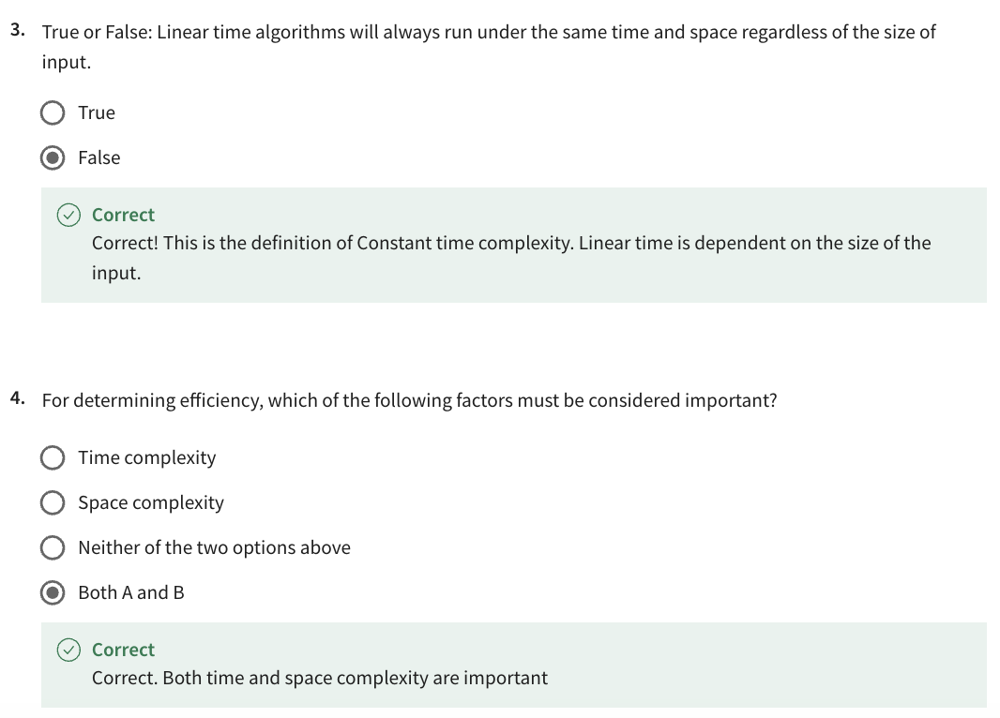
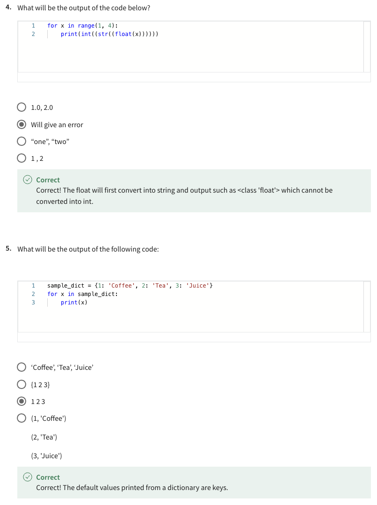

- [OOP in Python Notes in Vietnamese](#oop-in-python-notes-in-vietnamese)
- [Programming in Python](#programming-in-python)
  - [Module 1](#module-1)
    - [Knowledge check - Welcome to Python Programming](#knowledge-check---welcome-to-python-programming)
    - [Module quiz: Getting started with Python](#module-quiz-getting-started-with-python)
  - [Module 2](#module-2)
    - [Functions, loops and data structures](#functions-loops-and-data-structures)
    - [Knowledge check: Functions and Data structures](#knowledge-check-functions-and-data-structures)
    - [Exceptions in Python](#exceptions-in-python)
    - [Read in data, store, manipulate and output new data to a file](#read-in-data-store-manipulate-and-output-new-data-to-a-file)
    - [Module quiz: Basic Programming with Python](#module-quiz-basic-programming-with-python)
  - [Module 3](#module-3)
    - [Self-review: Make a cup of coffee](#self-review-make-a-cup-of-coffee)
    - [Knowledge check: Procedural Programming](#knowledge-check-procedural-programming)
    - [Mapping key values to dictionary data structures](#mapping-key-values-to-dictionary-data-structures)
    - [Knowledge check: Functional Programming](#knowledge-check-functional-programming)
    - [Self-review: Define a Class](#self-review-define-a-class)
    - [Abstract classes and methods](#abstract-classes-and-methods)
    - [Self-review: Working with Methods](#self-review-working-with-methods)
    - [Module quiz: Programming Paradigms](#module-quiz-programming-paradigms)
  - [Module 4](#module-4)
    - [Knowledge check: Modules](#knowledge-check-modules)
    - [Knowledge check: Popular Packages, Libraries and Frameworks](#knowledge-check-popular-packages-libraries-and-frameworks)
    - [Testing quiz](#testing-quiz)
    - [Module quiz: Modules, packages, libraries and tools](#module-quiz-modules-packages-libraries-and-tools)
  - [Module 5](#module-5)
    - [End-of-Course Graded Assessment: Using Python](#end-of-course-graded-assessment-using-python)

# OOP in Python [Notes in Vietnamese](https://viblo.asia/p/lap-trinh-huong-doi-tuong-trong-python-cho-nguoi-moi-3RlL5GYm4bB)

# Programming in Python

## Module 1

### Knowledge check - Welcome to Python Programming

### Module quiz: Getting started with Python

## Module 2

### Functions, loops and data structures

### Knowledge check: Functions and Data structures

### Exceptions in Python

### Read in data, store, manipulate and output new data to a file

### Module quiz: Basic Programming with Python

## Module 3

### Self-review: Make a cup of coffee

### Knowledge check: Procedural Programming

### Mapping key values to dictionary data structures

### Knowledge check: Functional Programming

### Self-review: Define a Class

### Abstract classes and methods

### Self-review: Working with Methods

### Module quiz: Programming Paradigms

## Module 4

### Knowledge check: Modules

### Knowledge check: Popular Packages, Libraries and Frameworks

### Testing quiz

### Module quiz: Modules, packages, libraries and tools

## Module 5

### End-of-Course Graded Assessment: Using Python

