- [Quizzes](#quizzes)
  - [Module 1](#module-1)
    - [Knowledge Check: Introduction to version control](#knowledge-check-introduction-to-version-control)
    - [Module Quiz: Software collaboration](#module-quiz-software-collaboration)
  - [Module 2](#module-2)
    - [Knowledge Check: Unix Commands](#knowledge-check-unix-commands)
    - [Module Quiz: Command Line](#module-quiz-command-line)
  - [Module 3](#module-3)
    - [Knowledge Check: Git and GitHub](#knowledge-check-git-and-github)
    - [Module Quiz: Working with Git](#module-quiz-working-with-git)
  - [Module 4](#module-4)
    - [End-of-course graded assessment](#end-of-course-graded-assessment)
- [Git Cheat Sheet (by GitHub)](#git-cheat-sheet-by-github)
  - [Configure tooling](#configure-tooling)
  - [Create repositories](#create-repositories)
  - [The .gitignore file](#the-gitignore-file)
  - [Branches](#branches)
  - [Synchronize changes](#synchronize-changes)
  - [Make changes](#make-changes)
  - [Redo commits](#redo-commits)
  - [GitHub Flow](#github-flow)
  - [Glossary](#glossary)
- [Version control in professional software development](#version-control-in-professional-software-development)
  - [Workflow](#workflow)
  - [Continuous Integration](#continuous-integration)
  - [Continuous Delivery](#continuous-delivery)
  - [Continuous Deployment](#continuous-deployment)
  - [Conclusion](#conclusion)
- [Staging vs. Production](#staging-vs-production)
  - [Development Environments](#development-environments)
  - [Staging](#staging)
  - [Production](#production)
- [Using Bash on Mac Terminal](#using-bash-on-mac-terminal)
  - [Bash commands](#bash-commands)
- [Resolving conflicts](#resolving-conflicts)

# Quizzes

## Module 1

### Knowledge Check: Introduction to version control

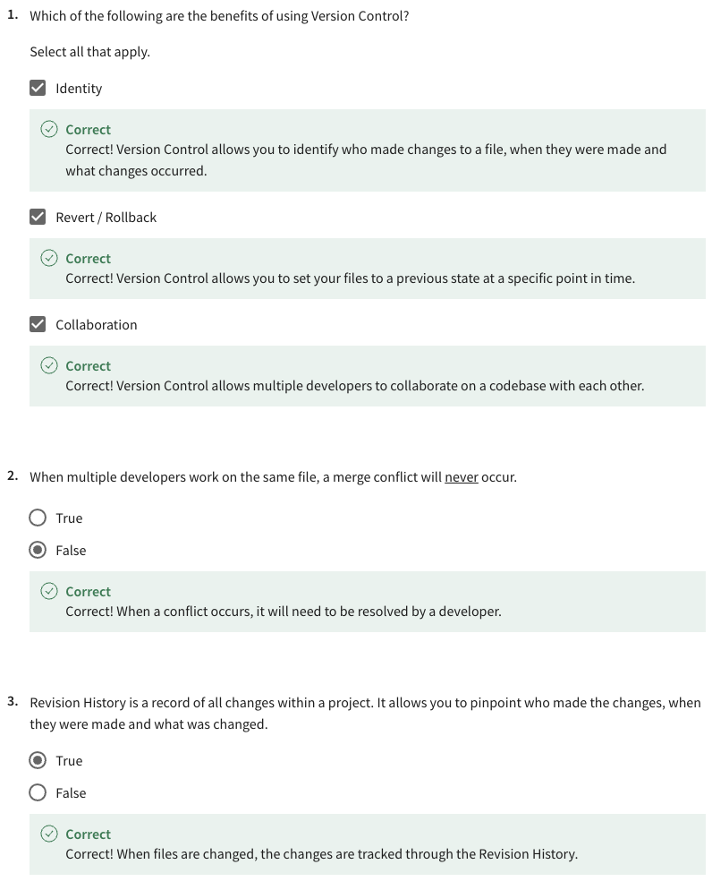
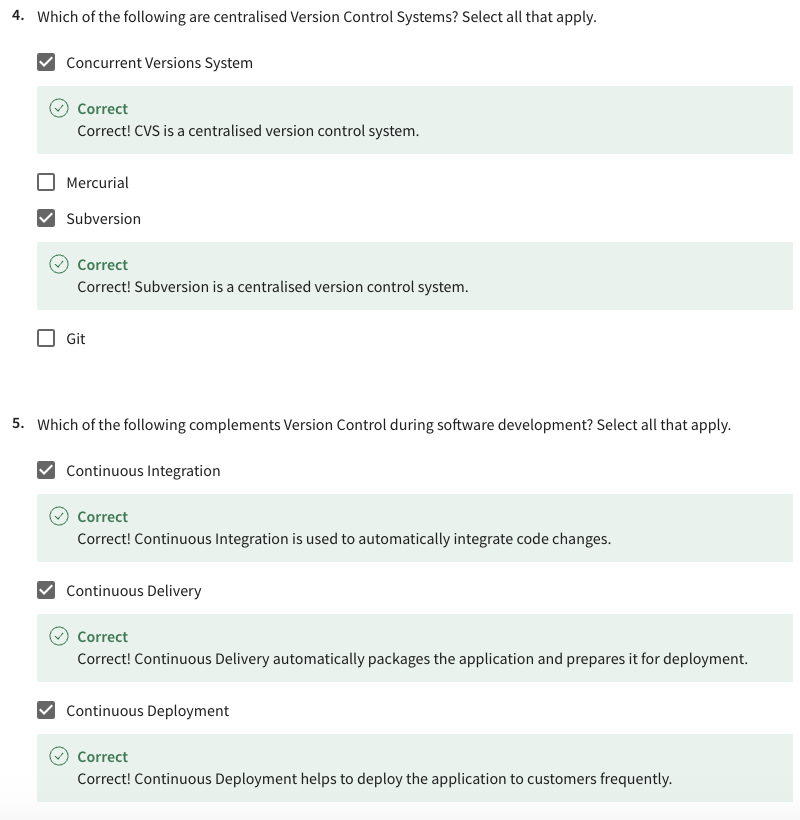

### Module Quiz: Software collaboration

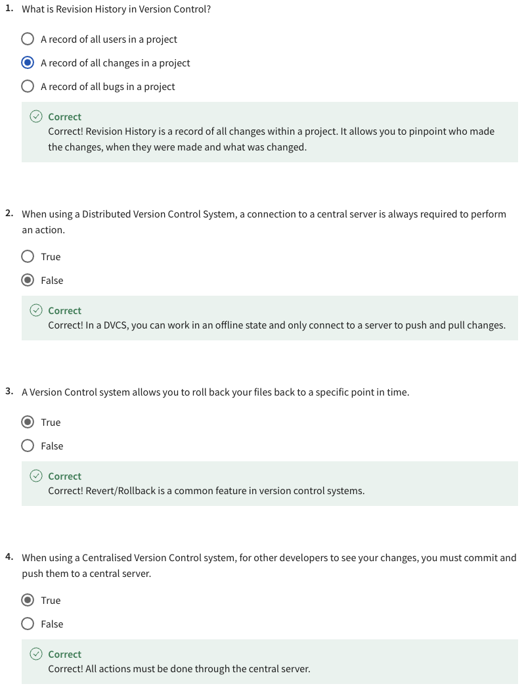
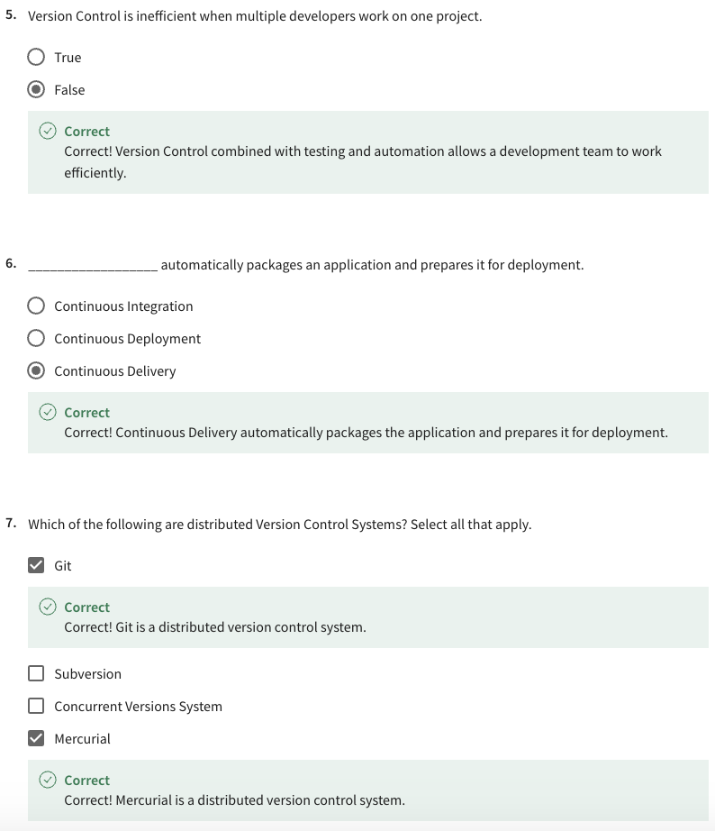
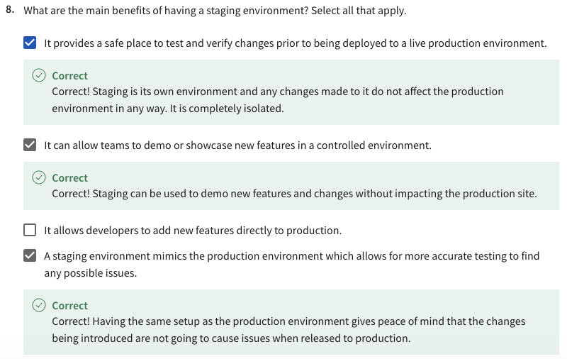

## Module 2

### Knowledge Check: Unix Commands

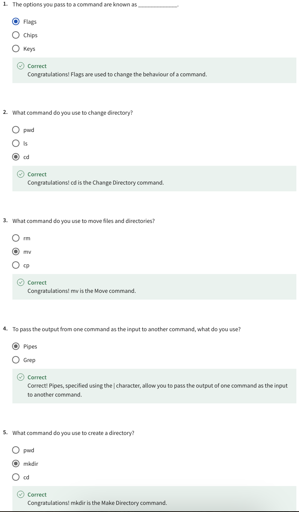

### Module Quiz: Command Line

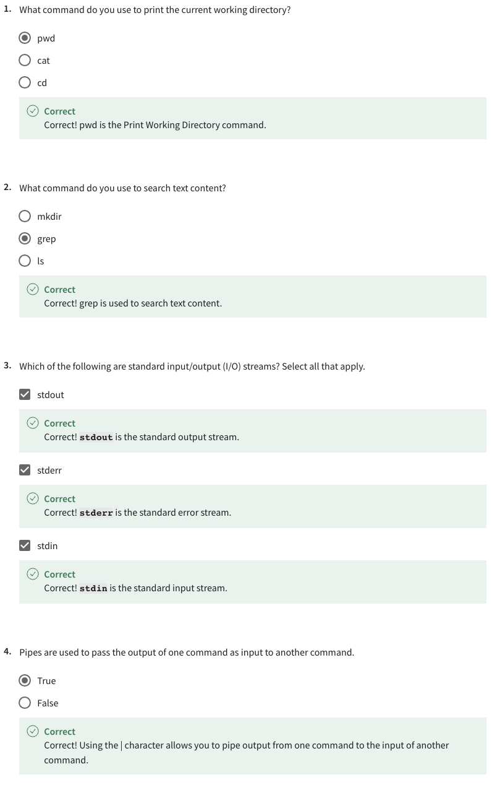
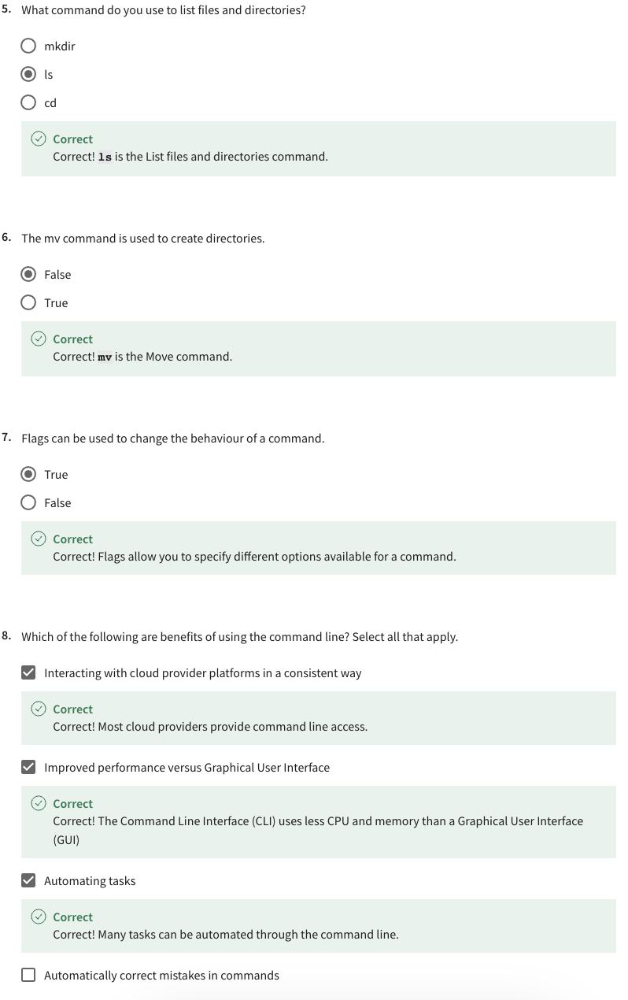

## Module 3

### Knowledge Check: Git and GitHub

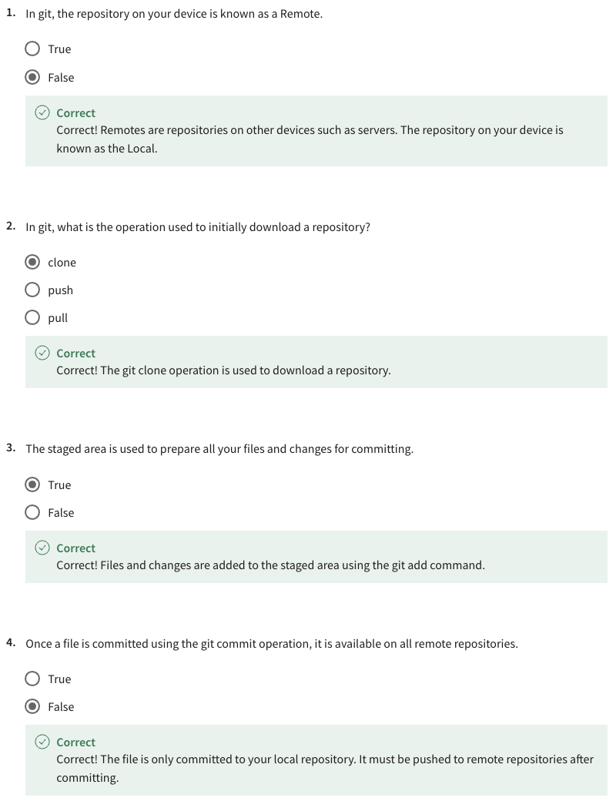
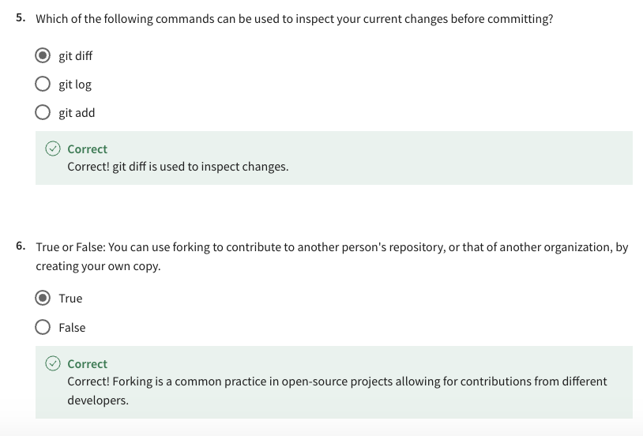

### Module Quiz: Working with Git

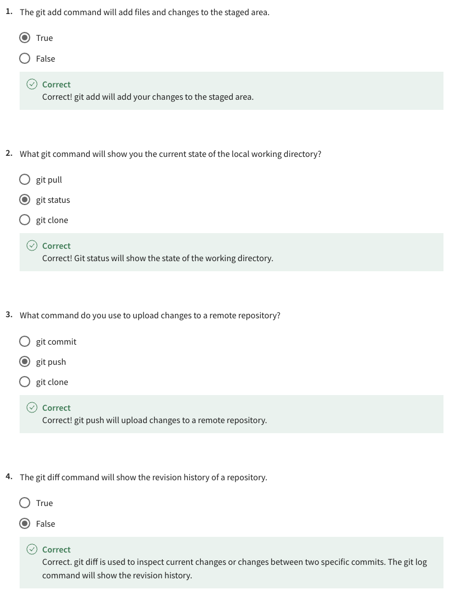
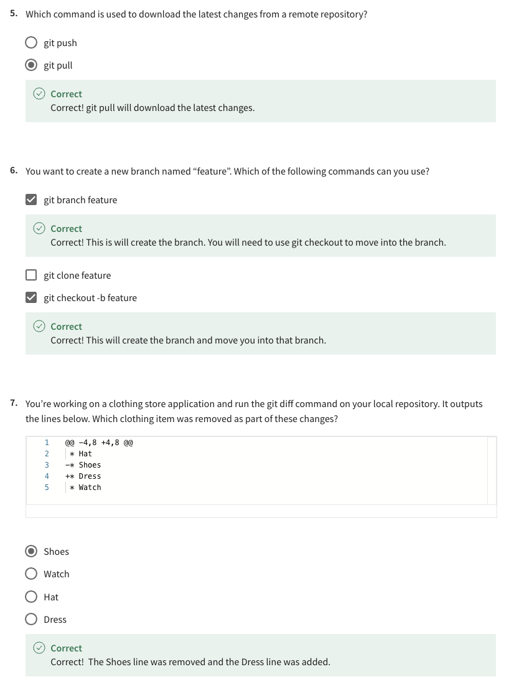
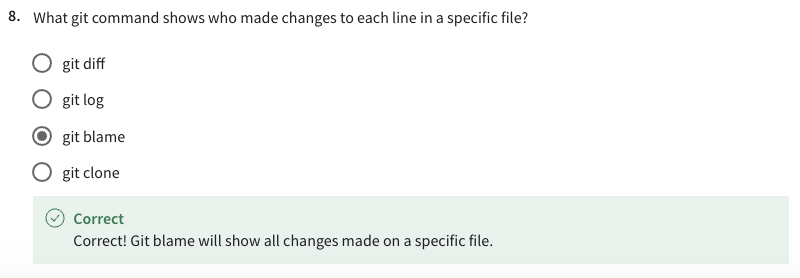

## Module 4

### End-of-course graded assessment

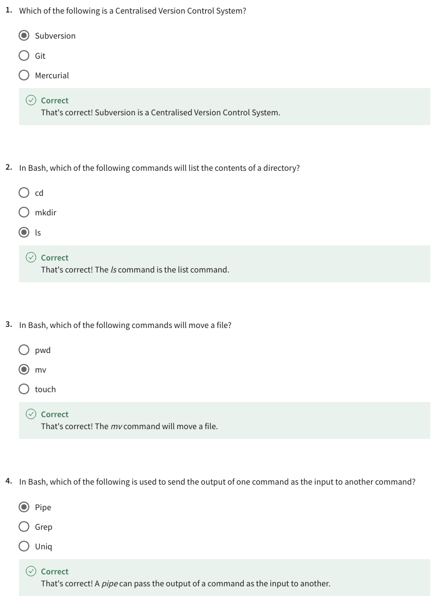
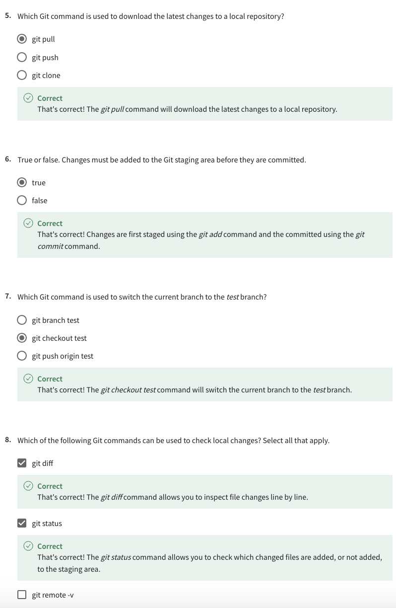
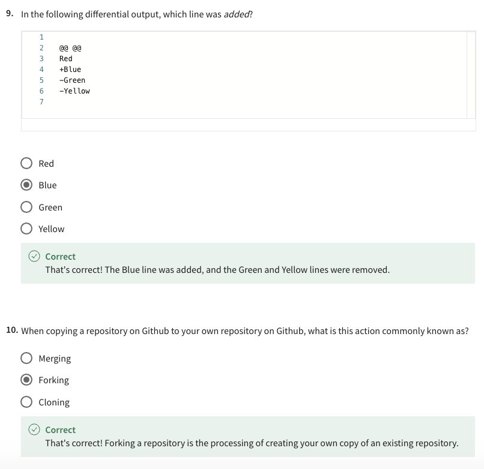

# Git Cheat Sheet (by GitHub)

Git is the open source distributed version control system that facilitates GitHub activities on your laptop or desktop. This cheat sheet summarizes commonly used Git command line instructions for quick reference.

## Configure tooling

Configure user information for all local repositories

- Sets the name you want attached to your commit transactions

  ```
  git config --global user.name "[name]"
  ```

- Sets the email you want attached to your commit transactions

  ```
  git config --global user.email "[email address]"
  ```

- Enables helpful colorization of command line output
  ```
  git config --global color.ui auto
  ```

## Create repositories

When starting out with a new repository, you only need to do it once; either locally, then push to GitHub, or by cloning an existing repository.

- Turn an existing directory into a git repository

  ```
  git init
  ```

- Clone (download) a repository that already exists on GitHub, including all of the files, branches, and commits
  ```
  git clone [url]
  ```

## The .gitignore file

Sometimes it may be a good idea to exclude files from being tracked with Git. This is typically done in a special file named `.gitignore`. You can find helpful templates for `.gitignore` files at [github.com/github/gitignore](https://github.com/github/gitignore).

## Branches

Branches are an important part of working with Git. Any commits you make will be made on the branch you're currently “checked out” to. Use `git status` to see which branch that is.

- Creates a new branch

  ```
  git branch [branch-name]
  ```

- Switches to the specified branch and updates the working directory

  ```
  git checkout [branch-name]
  ```

- Combines the specified branch’s history into the current branch. This is usually done in pull requests, but is an important Git operation.

  ```
  git merge [branch]
  ```

- Deletes the specified branch
  ```
  git branch -d [branch-name]
  ```

## Synchronize changes

Synchronize your local repository with the remote repository on GitHub.com

- Downloads all history from the remote tracking branches

  ```
  git fetch
  ```

- Combines remote tracking branch into current local branch

  ```
  git merge
  ```

- Uploads all local branch commits to GitHub

  ```
  git push
  ```

- Updates your current local working branch with all new commits from the corresponding remote branch on GitHub. `git pull` is a combination of `git fetch` and `git merge`
  ```
  git pull
  ```

## Make changes

Browse and inspect the evolution of project files

- Lists version history for the current branch

  ```
  git log
  ```

- Lists version history for a file, including renames

  ```
  git log --follow [file]
  ```

- Shows content differences between two branches

  ```
  git diff [first-branch]...[second-branch]
  ```

- Outputs metadata and content changes of the specified commit

  ```
  git show [commit]
  ```

- Snapshots the file in preparation for versioning

  ```
  git add [file]
  ```

- Records file snapshots permanently in version history
  ```
  git commit -m "[descriptive message]"
  ```

## Redo commits

Erase mistakes and craft replacement history

- Undoes all commits after [commit], preserving changes locally

  ```
  git reset [commit]
  ```

- Discards all history and changes back to the specified commit
  ```
  git reset --hard [commit]
  ```

CAUTION! Changing history can have nasty side effects. If you need to change commits that exist on GitHub (the remote), proceed with caution. If you need help, reach out at github.community or contact support.

## GitHub Flow

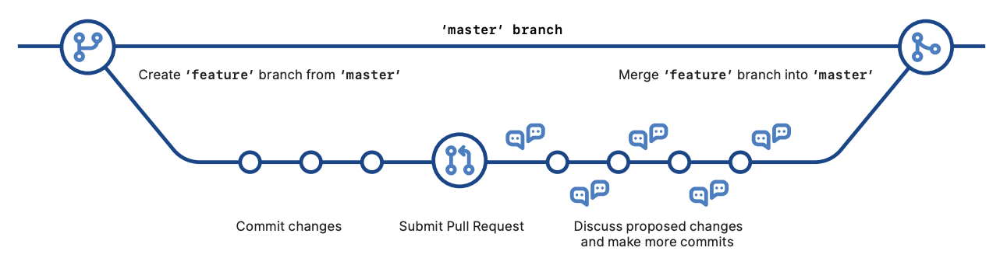

## Glossary

**git:** an open source, distributed version-control system

**GitHub:** a platform for hosting and collaborating on Git repositories

**commit:** a Git object, a snapshot of your entire repository compressed into a SHA

**branch:** a lightweight movable pointer to a commit

**clone:** a local version of a repository, including all commits and branches

**remote:** a common repository on GitHub that all team member use to exchange their changes

**fork:** a copy of a repository on GitHub owned by a different user

**pull request:** a place to compare and discuss the differences introduced on a branch with reviews, comments, integrated tests, and more

**HEAD:** representing your current working directory, the HEAD pointer can be moved to different branches, tags, or commits when using `git checkout`

# Version control in professional software development

Version Control plays a crucial part in software development. As a developer, you’ll work with other developers on projects to deliver software to customers. Depending on the role, you could be working with a small team of 2 or 3 developers in a single project or a large team spanning multiple projects. In either scenario, Version Control will be a crucial tool to help your team succeed.

However, Version Control must be complemented by other tools and procedures to ensure quality and efficiency throughout the software development process. In this lesson, we’ll explore some of the common tools and strategies developers use in conjunction with Version Control.

## Workflow

Using Version Control without a proper workflow is like building a city without traffic lights; without appropriate management, everything will turn into chaos.

For example, let’s say you’re working on a big project and editing a file. Another developer also starts editing a file. Both of you submit the file to the VCS at the same time. Now there’s a conflict! How should the conflict be resolved? A good workflow will have a process for resolving conflicts.

Another example is when a new junior developer is joining your team. If the project code is used for a critical system, it is risky to allow them to submit code changes directly. To solve this, many developers use a peer review system where another developer must review code before it can be merged in.

Workflows are essential to ensure code is managed correctly and reduce mistakes from happening. Different projects will have different workflows. In this course, you’ll learn some common workflows using the Git Version Control System.

## Continuous Integration

Continuous Integration, or CI, is used to automate the integration of code changes from multiple developers into a single main stream. Using a workflow whereby small changes are merged frequently, often many times per day, will reduce the number of merge conflicts.

This process is widespread in test-driven software development strategies. CI is often used to automatically compile the project and run tests on every code change to ensure that the build remains stable and prevent regressions in functionality.

## Continuous Delivery

Continuous Delivery is an extension of Continuous Integration. Once the changes have been merged into the main stream, a Continuous Delivery system automatically packages the application and prepares it for deployment. This helps avoid human error when packaging the application.

## Continuous Deployment

Continuous Deployment is an extension of Continuous Delivery. The goal of Continuous Deployment is to deploy and release software to customers frequently and safely. The strategy commonly involves automatically deploying to a test (also known as staging) environment first to validate the deployment package and software changes. Once validated, it can automatically deploy to the live (also known as production) environment for customers.

## Conclusion

With these tools and procedures, it is possible to understand how software starts from a developer writing code to being deployed live for customers to use. Of course, there is much more to running a live software service, but that is a lesson for another day.

# Staging vs. Production

## Development Environments

Every development team prior to releasing their new features or changes needs to verify that the code they do release is not going to cause any issues or bugs. In order to achieve this, they normally set up multiple environments for different ways to test and verify. A common practice is for teams to have a developer environment, a UAT or QA environment, and a staging environment. The main purpose of this flow is to find any potential issues that may arise due to changes or new features being added to the codebase. The more ways to test the changes the less likely bugs will be introduced.

## Staging

The staging environment should mimic your production environment. The reason for this is because you want to test the code in an environment that matches what you have in production. This allows teams to spot or find any potential issues prior to them getting to production. The closer the staging environment is to your production, the more accurate your testing is going to be. Staging environments can also be used for testing and verifying new features and allow other teams including QA or stakeholders to see and use those features as a pre-trial. Staging should also cover all areas of the architecture of the application including the database and any other services that may be required. Areas that benefit from staging environments include:

**New Features**

Developers submitting new features along with feature flags for turning them on and off should always do a testing round in a staging environment. They allow teams to verify that the feature works, it can be turned on and off via configuration flags and also that it does not break or interfere with existing functionality.

**Testing**

As the staging environment mimics your production environment, it's also a great place to run tests. QA teams will normally use it to verify new features, configuration changes or software updates/patching. The types of testing covered will be Unit testing, Integration testing and performance testing. All except performance testing can also be carried out in production. Performance can also be completed in production but only at specific times - usually out of hours as it will have a drastic effect on the user experience.

Sometimes it is not always feasible to have an exact replication either due to costs or time. Certain areas can be cut back - for example, if your service is load balanced on 10 virtual machines in production, you could still have 4 virtual machines in staging. The underlying architecture is the same but the overall performance may be different.

**Migrations**

Staging is a perfect place to test and verify data migrations. Snapshots can be taken from production and used to test your migration scripts to confirm your changes will not break anything. If in the case it does cause an issue, you simply rollback and try again. Doing something like a migration in production is extremely risky and error-prone.

**Configuration Changes**

Configuration can also cause headaches for teams, especially in a large cloud-based architecture. Having a staging environment will allow you to spot any potential issues or bottlenecks.

## Production

Production is live. It's out there for people to see and/or interact with. Any issues or problems you may have had should have been caught and fixed in the staging environment. The staging area gives the team a safety net to catch these possible issues. Any code that is deployed to production should have been tested and verified before the deployment itself.

**Downtime**

Downtime for any service especially customer facing will most likely be revenue impacting. If customers can not access or use your website or app to its full capabilities, it will most likely have a cost involved. Take for example an e-commerce company that allows users to buy goods and services online. If they release a new feature to their shopping cart which actually breaks the payment process, this will have an impact on customers not being able to buy goods online.

**Vulnerabilities**

Cyber-security should also play a big role in what gets released in production. Any updates to software such as patching or moving to the latest version should be checked and verified. This is also the same rule for not upgrading software when critical updates are released.

**Reputation**

Downtime or issues in production is damaging for a company as it does not instill confidence in end users. If something is down or broken it can cause the company to lose potential customers.

# Using Bash on Mac Terminal

## Bash commands

Bash provides a list of commands for navigating through files, viewing the contents of files, and edit features for changing or updating the contents of a file. Below is a list of the most common commands:

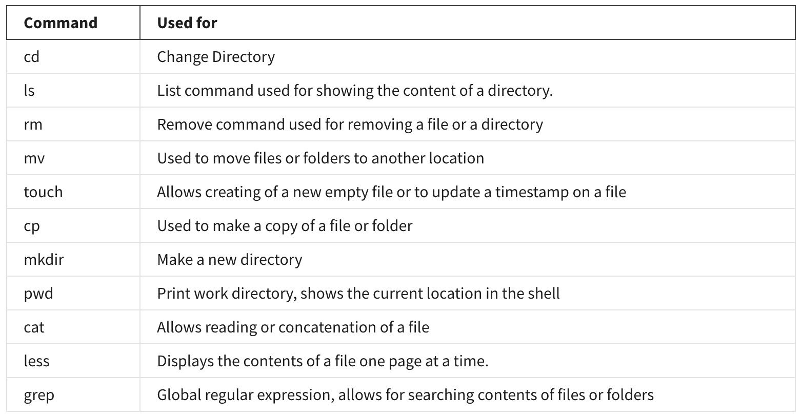

# Resolving conflicts

Conflicts will normally occur when you try to merge a branch that may have competing changes. Git will normally try to automatically merge (auto-merge), but in the case of a conflict, it will need some confirmation. The competing changes need to be resolved by the end user. This process is called merging or rebasing.

The developer must look at the changes on the server and their local and validate which changes should be resolved.

A merge conflict example is when two developers work on their dependent branches. Both developers are working on the same file called Feature.js. Each of their tasks is to add a new feature to an existing method. Developer 1 has a branch called feature1, and developer 2 has a branch called feature2.

Developer 1 pushes the code with the changes to the remote repository. Developer 2 pushes their changes.

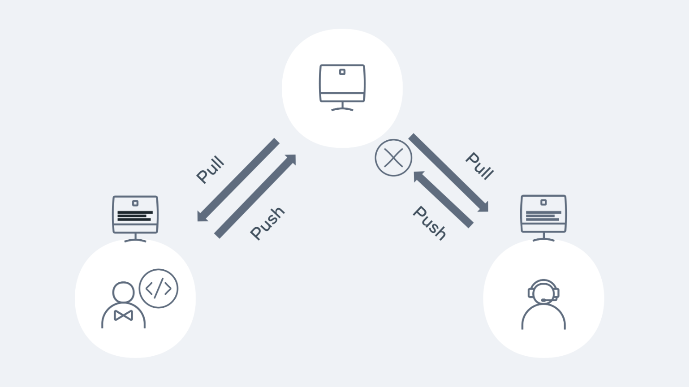

Let's walk through how this would happen in Git. Both developers 1 and 2 check out the main repository on Monday morning. They both have the same copy. Both developers check out a new branch - feature 1 and 2.

```
git pull
git checkout -b feature1
```

```
git pull
git checkout -b feature2
```

Developer 1 makes their changes to a file called `Feature.js` and then commits the changes to the repository for approval via a PR (pull request)

```
git add Feature.js
git commit -m 'chore: added feature 1!!'
git pull origin main
git push -u origin feature1
```

The PR is reviewed and then merged into the main branch. Meanwhile, Developer 2 is starting to code on his feature. Again, they go through the same process as Developer 1:

```
git add Feature.js
git commit -m 'chore: added feature 2!!!'
git pull origin main

From github.com:demo/demo-repo
 * branch            main       -> FETCH_HEAD
   9012934..d3b3cc0  main       -> origin/main
Auto-merging Feature.js
CONFLICT (content): Merge conflict in Feature.js
Automatic merge failed; fix conflicts and then commit the result.
```

Git lets us know that a merge conflict has occurred and needs to be fixed before it can be pushed to the remote repo. Running git status will also give us the same level of detail:

```
git status
    On branch feature2
You have unmerged paths.
  (fix conflicts and run "git commit")
  (use "git merge --abort" to abort the merge)

Unmerged paths:
  (use "git add <file>..." to mark resolution)
        both modified:   Feature.js

no changes added to commit (use "git add" and/or "git commit -a")
```

In order to merge, Developer 2 needs to see and compare the changes from Developer 1. It is good practice to first see what branch is causing the merge issue. Developer 2 runs the following command:

```
git log --merge

commit 79bca730b68e5045b38b96bec35ad374f44fe4e3 (HEAD -> feature2)
Author: Developer 2
<developer2@demo.com>
Date:   Sat Jan 29 16:55:40 2022 +0000

    chore: add feature 2

commit 678b0648107b7c53e90682f2eb8103c59f3cb0c0
Author: Developer 1
<developer1@demo.com>
Date:   Sat Jan 29 16:53:40 2022 +0000

    chore: add feature 1
```

We can see from the above code that the team's conflicting changes occurred in feature 1 and 2 branches. Developer 2 now wants to see the change that is causing the conflict.

```
git diff

diff --cc Feature.js
index 1b1136f,c3be92f..0000000
--- a/Feature.js
+++ b/Feature.js
@@@ -1,4 -1,4 +1,8 @@@
  let add = (a, b) => {
++<<<<<<< HEAD
 +  if(a + b > 10) { return 'way too much'}
++=======
+   if(a + b > 10){ return 'too much' }
++>>>>>>> d3b3cc0d9b6b084eef3e0afe111adf9fe612898e
    return a + b;
  }
```

The only difference is the wording in the return statement. Developer 1 added 'too much,' but Developer 2 added 'far too much. Everything else is identical in terms of merging and it's a pretty easy fix. Git will show arrows <<< >>> to signify the changes. Developer 2 removes the markers so the code is ready for submission:

```
let add = (a, b) => {
  if(a + b > 10) { return 'way too much'}
  return a + b;
}
```

```
git add Feature.js
git commit -m 'fix merge conflicts'
git push -u origin feature2
```
