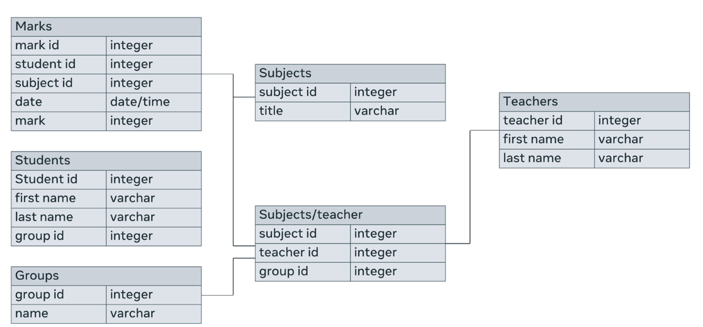
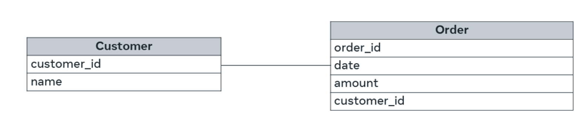
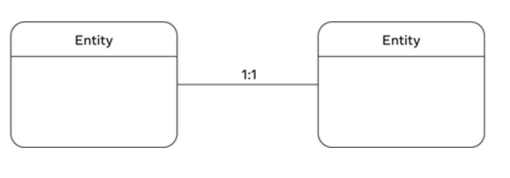
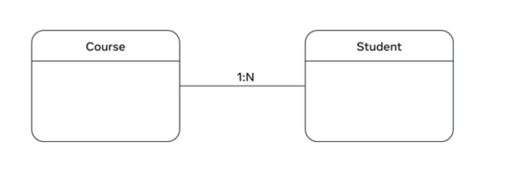

- [Quizzes](#quizzes)
  - [Module 1](#module-1)
    - [Knowledge check: Databases and data](#knowledge-check-databases-and-data)
    - [Knowledge check: SQL syntax review](#knowledge-check-sql-syntax-review)
    - [Knowledge check: Database structure](#knowledge-check-database-structure)
    - [Module quiz: Introduction to Databases](#module-quiz-introduction-to-databases)
  - [Module 2](#module-2)
    - [Self review: Working with numbers](#self-review-working-with-numbers)
    - [Self review: Working with strings](#self-review-working-with-strings)
    - [Self review: Working with default values](#self-review-working-with-default-values)
    - [Self review: Choosing the right data type for a column](#self-review-choosing-the-right-data-type-for-a-column)
    - [Self-review: Create database, create table and insert data](#self-review-create-database-create-table-and-insert-data)
    - [Self review: Practicing table creation](#self-review-practicing-table-creation)
    - [Knowledge check: Create, insert and select](#knowledge-check-create-insert-and-select)
    - [Self-review: Record deletion](#self-review-record-deletion)
    - [Knowledge check: Update and Delete](#knowledge-check-update-and-delete)
    - [Module quiz: Create, Read, Update and Delete (CRUD) Operations](#module-quiz-create-read-update-and-delete-crud-operations)
  - [Module 3](#module-3)
    - [Self-review: ORDER BY and WHERE](#self-review-order-by-and-where)
    - [Module quiz: SQL operators and sorting and filtering data](#module-quiz-sql-operators-and-sorting-and-filtering-data)
  - [Module 4](#module-4)
    - [Knowledge check: Database schema](#knowledge-check-database-schema)
    - [Knowledge check: Defining keys](#knowledge-check-defining-keys)
    - [Database relations and keys](#database-relations-and-keys)
    - [Knowledge Check: Database normalization](#knowledge-check-database-normalization)
    - [Self-review: Database schema examples](#self-review-database-schema-examples)
    - [Module quiz: Database design](#module-quiz-database-design)
  - [Module 5](#module-5)
    - [Final graded quiz: Intro to databases](#final-graded-quiz-intro-to-databases)
- [Relational data example charts](#relational-data-example-charts)
  - [Bar chart](#bar-chart)
  - [Bubble chart](#bubble-chart)
  - [Line chart](#line-chart)
  - [Pie Chart](#pie-chart)
  - [What chart do I choose to present my data?](#what-chart-do-i-choose-to-present-my-data)
- [Database Evolution](#database-evolution)
  - [Hierarchical database systems](#hierarchical-database-systems)
  - [Network databases](#network-databases)
  - [Relational database system](#relational-database-system)
  - [Object-oriented databases](#object-oriented-databases)
  - [NoSQL databases](#nosql-databases)
- [Common SQL commands](#common-sql-commands)
  - [DDL](#ddl)
  - [DML](#dml)
  - [DCL](#dcl)
  - [TCL](#tcl)
- [Tables overview](#tables-overview)
  - [Data types](#data-types)
  - [Example](#example)
  - [Tables in a relational database](#tables-in-a-relational-database)
  - [Important points](#important-points)
  - [Primary key](#primary-key)
  - [Example](#example-1)
  - [Importance of primary key](#importance-of-primary-key)
  - [When not to use a primary key](#when-not-to-use-a-primary-key)
  - [Composite primary key](#composite-primary-key)
  - [Foreign key](#foreign-key)
  - [Example](#example-2)
  - [Importance of foreign key](#importance-of-foreign-key)
  - [Referential integrity](#referential-integrity)
  - [Joining tables](#joining-tables)
  - [Cascading updates and deletes](#cascading-updates-and-deletes)
- [Database structure overview](#database-structure-overview)
  - [Database structure](#database-structure)
  - [Components of database structure](#components-of-database-structure)
  - [Importance of database structure](#importance-of-database-structure)
  - [How to design a database structure](#how-to-design-a-database-structure)
  - [Benefits of a well-designed database structure](#benefits-of-a-well-designed-database-structure)
  - [Challenges of designing a database structure](#challenges-of-designing-a-database-structure)
  - [Tables](#tables)
  - [Fields](#fields)
  - [Records](#records)
  - [Data types](#data-types-1)
  - [Logical database structure](#logical-database-structure)
  - [Relationships](#relationships)
  - [Entity Relationship Diagram (ERD)](#entity-relationship-diagram-erd)
  - [Physical database structure](#physical-database-structure)
  - [Foreign key](#foreign-key-1)
  - [Relationship between physical database structure and foreign key](#relationship-between-physical-database-structure-and-foreign-key)
- [CRUD Operations](#crud-operations)
  - [Creating a Database](#creating-a-database)
  - [Creating a Database Table with SQL](#creating-a-database-table-with-sql)
    - [Using the CREATE TABLE Statement](#using-the-create-table-statement)
  - [Altering Tables in SQL](#altering-tables-in-sql)
  - [Insert Statements](#insert-statements)
    - [Multiple rows insertion](#multiple-rows-insertion)
  - [Query all data from a table](#query-all-data-from-a-table)
  - [Updating a table using the UPDATE statement](#updating-a-table-using-the-update-statement)
  - [Deleting records from a table using the DELETE statement](#deleting-records-from-a-table-using-the-delete-statement)
- [String data types](#string-data-types)
- [Default Values](#default-values)
  - [Database constraints](#database-constraints)
    - [NOT NULL constraint](#not-null-constraint)
    - [DEFTAUL constraints:](#deftaul-constraints)
- [SQL arithmetic operators](#sql-arithmetic-operators)
  - [Using the addition operator](#using-the-addition-operator)
  - [Using the subtraction operator](#using-the-subtraction-operator)
  - [Using the multiplication operator](#using-the-multiplication-operator)
  - [Using the division operator](#using-the-division-operator)
  - [Using the modulus operator](#using-the-modulus-operator)
- [SQL comparison operators](#sql-comparison-operators)
  - [Exercise:](#exercise)
  - [Inequality comparison operators:](#inequality-comparison-operators)
- [SQL ORDER BY clause](#sql-order-by-clause)
- [The SQL WHERE clause](#the-sql-where-clause)
  - [Using AND condition;](#using-and-condition)
  - [Here is another example of multiple operators and conditions;](#here-is-another-example-of-multiple-operators-and-conditions)
- [Districnt Clause](#districnt-clause)
  - [What is SELECT DISTINCT statement?](#what-is-select-distinct-statement)
  - [When to use SELECT DISTINCT statement?](#when-to-use-select-distinct-statement)
  - [How to use SELECT DISTINCT statement?](#how-to-use-select-distinct-statement)
- [Exploring database schema](#exploring-database-schema)
  - [What is a database schema?](#what-is-a-database-schema)
    - [Conceptual or logical schema](#conceptual-or-logical-schema)
    - [Internal or physical schema](#internal-or-physical-schema)
    - [External or view schema](#external-or-view-schema)
- [Building a schema](#building-a-schema)
  - [Database schema](#database-schema)
  - [Building a database schema for a restaurant booking scenario](#building-a-database-schema-for-a-restaurant-booking-scenario)
  - [The logical database schema](#the-logical-database-schema)
  - [The physical database schema](#the-physical-database-schema)
- [Relational model](#relational-model)
  - [What is the relational model?](#what-is-the-relational-model)
  - [Fundamental concepts of the relational model](#fundamental-concepts-of-the-relational-model)
    - [Relation](#relation)
    - [Column](#column)
  - [Domain](#domain)
  - [Record or tuple](#record-or-tuple)
  - [Key](#key)
  - [Degree](#degree)
  - [Cardinality](#cardinality)
  - [What are constraints?](#what-are-constraints)
    - [Key constraints](#key-constraints)
    - [Domain constraints](#domain-constraints)
    - [Referential integrity constraints](#referential-integrity-constraints)
  - [Types of relationships](#types-of-relationships)
    - [One-to-one](#one-to-one)
    - [One-to-many](#one-to-many)
    - [Many-to-many](#many-to-many)
- [Relational model](#relational-model-1)
  - [Relationships between tables](#relationships-between-tables)
  - [ER diagrams](#er-diagrams)
  - [Example ER diagram](#example-er-diagram)
  - [Primary keys in database tables](#primary-keys-in-database-tables)
- [Foreign keys in relational databases](#foreign-keys-in-relational-databases)
  - [What is a foreign key?](#what-is-a-foreign-key)
  - [How to use foreign keys](#how-to-use-foreign-keys)
  - [Benefits of using foreign keys](#benefits-of-using-foreign-keys)
- [Entity relationship diagrams (ERD)](#entity-relationship-diagrams-erd)
  - [Entity representation](#entity-representation)
  - [Relationship representation](#relationship-representation)
  - [Attributes representation](#attributes-representation)
- [Database normalization](#database-normalization)
  - [The 3 fundamental normalization forms are known as](#the-3-fundamental-normalization-forms-are-known-as)
  - [First Normal From (1NF):](#first-normal-from-1nf)
  - [Second Normal Form (2NF):](#second-normal-form-2nf)
  - [Third Normal Form (3NF):](#third-normal-form-3nf)

# Quizzes

## Module 1

### Knowledge check: Databases and data


### Knowledge check: SQL syntax review


### Knowledge check: Database structure


### Module quiz: Introduction to Databases


## Module 2

### Self review: Working with numbers


### Self review: Working with strings


### Self review: Working with default values


### Self review: Choosing the right data type for a column


### Self-review: Create database, create table and insert data


### Self review: Practicing table creation


### Knowledge check: Create, insert and select


### Self-review: Record deletion


### Knowledge check: Update and Delete


### Module quiz: Create, Read, Update and Delete (CRUD) Operations


## Module 3

### Self-review: ORDER BY and WHERE


### Module quiz: SQL operators and sorting and filtering data


## Module 4

### Knowledge check: Database schema


### Knowledge check: Defining keys


### Database relations and keys


### Knowledge Check: Database normalization


### Self-review: Database schema examples


### Module quiz: Database design


## Module 5

### Final graded quiz: Intro to databases


# Relational data example charts

Data gets collected and stored in databases from various sources for various reasons. For example, customer orders, student course enrollments, and user interaction and feedback to personalize content and improve services.

It’s important to organize data, process it, and present it efficiently to make it more useful and meaningful to people. The way data is related and presented enables people to form a better understanding of existing data. This understanding can be aided by relevant charts that present data visually using combinations of text, symbols, and graphic elements to illustrate the relationship between data in a meaningful way.

Charts can convey a great deal of information and can capture people’s attention in a way that helps them to make better decisions and take suitable actions. Here, you will learn about basic charts commonly used to relate data together and present it in a simple visual way.

## Bar chart

A bar chart is a graph that presents categorical data with rectangular bars, where the heights of the bars are proportional to the values that they represent.

For example, the owner of a bookshop in London has had many challenges during the COVID-19 lockdown and wants to know more about their business performance and progress each year from 2019. A bar chart could be very useful to show how sales revenue has changed over the past few years and how the pandemic impacted the business during lockdown.


This chart uses bars to present the bookshop’s sales data between 2019 and 2022. The x-axis presents the individual years, while the y-axis presents the sales value. The bars illustrate the sales achieved each year. The taller the bar, the greater the value of sales. In this case, the tallest bar is in 2018, which indicates that this was the most successful year for the business. The smallest bar is in 2022, which indicates that this was the worst year for sales.

## Bubble chart

A Bubble chart is another popular type of data chart. It shows how different values compare to each other in terms of bubble size. The smaller bubbles represent smaller values, and the larger bubbles represent larger values.

Let's examine the bubble chart below, which presents information about the 10 largest countries in the world in terms of population in 2015.


In this example, a country's population value determines the size of each country’s bubble.

There are large bubbles for China (around 1.4 billion people) and India (about 1.3 billion people), as these countries have the largest populations. Then there are medium-sized bubbles for the USA (about 330 million people) and Indonesia (about 270 million people). Russia (about 145 wmillion people) and Egypt (around 100 million people) have smaller-sized bubbles, as they have smaller comparable populations.

These bubbles give you a good idea of the difference between the countries regarding population sizes. The bubbles also help people to remember this kind of information, as human memory prefers graphical representation of data. After all, "a picture is worth a thousand words".

## Line chart

A line chart presents information as a series of data points called “markers” connected by straight line segments. Line charts are extremely popular and are widely used in most data analytics fields.

The chart below depicts a company's gold price over the past month. There is a line that starts with the 10th of April when gold stood at $62,650 for 1kg. This line connects the dots that visualize the change in the gold price over time. The up-and-down movement of the line helps highlight positive and negative changes.

Data analysts commonly use this chart to predict the market's future based on overall trends.


## Pie Chart

A pie chart is another type of data chart that displays how various data make up a whole of 100 percent. In this type of chart, each data point is allocated a "slice" of the pie according to its value.

The following “Sports pie chart” depicts the type of sport students prefer in a class.


If you ask someone looking at this chart about the percentage of students who like soccer, their answer will be 50%, as it is the slice's size that helps them to identify the percentage. In this case, “Soccer” occupies half of the pie and, therefore, it is 50% of the whole. “Tennis” and “Swimming” represent the other half of the pie. Since they are equals, each is a quarter of the pie, which is 25% of the whole.

In addition to the charts introduced earlier in this reading, other charts could be used for different purposes. An example is the area chart, which combines the line chart and the bar chart to compare two or more quantities of data. Other commonly used charts include:

- dual axis charts,

- Gantt charts,

- heat maps

- and scatter plot charts.

## What chart do I choose to present my data?

Some charts can serve multiple purposes, whereas others are much better at conveying specific types of information to the audience. Line charts, for example, are best used to identify trends that help predict the future. Pie charts are a simple way to show how various parts create a whole. They are also quite easy to build. However, it’s difficult to add a percentage to each slice if there are many slices or if the slices are not exactly a half, a quarter, or a third of the whole.

The answer to the question depends on several factors, including:

- the target audience who will use the information,

- the idea you intend to present,

- and the goal you want to achieve.

Your choice of chart will be determined by the message you want to deliver to your audience, the type and amount of data you want to load to the graph, and so on.

Once you have identified the audience and assessed the data, you can experiment with different charts to find the best option. If multiple charts are suitable to present your data, choose the one that engages your audience and boosts their interest in the information.

By considering all these factors, you should be able to identify the most appropriate chart that serves your purpose.

# Database Evolution

## Hierarchical database systems

Hierarchical database systems that were in use during the same era store data in a hierarchically arranged manner.

Think about it this way: parents can have many children, but one child can only have one parent. In other words, the database represents a one-to-many relationship: all attributes of a specific record are listed under an entity type.

Below is an example of how data is stored in a hierarchical database. In this case, it is data on college students who are taking different courses. A course can be assigned to only a single student, but a student can take as many courses as they want. Thus, there is a one-to-many relationship.

There are three students:

- John,

- Anil

- and Rohan

And there are four courses:

- C#,

- Perl,

- Python

- and Java.

Student and Course are the entity types. John takes C# and Anil takes both Python and Java. Rohan takes Perl.


## Network databases

Network databases were introduced by Charles Bachmann. Unlike the hierarchical database model, a network database allows multiple parent and child relationships. In other words, many-to many relationships. In network database terminology, a child record is known as a member. A member or child can be reached through more than one parent, which is called an owner.

A network database has a graph-like structure, and it allows you to represent more complex relationships among data.

Here's an example of a network database. A teacher can teach multiple courses and a course can have multiple teachers teaching it.


In this era, a language known as the SEQUEL query language was used to work with databases. Later on, with relational databases, this developed into SQL (Structured Query Language) which was made a standard query language to work with databases by the American National Standards Institute once relational database systems were introduced.

## Relational database system

The relational database system that was introduced in the 1980s is still the most used database system. It was invented by E. F. Codd and it’s the successor of hierarchical and network database systems. It was viewed as a major paradigm shift in database technology.

In a relational database system, data is stored in tables. The columns of the table hold attributes of the data. Each record usually has a value for each attribute, making it easy to establish the relationships between data points. In a relational database, each row in the table is a record with a unique ID attribute called the primary key. A relational database stores and provides access to data that are related to one another using an attribute known as a foreign key.

Here’s an example of what a Relational Database would look like. Here, there are tables with attributes/ columns that store rows/records of data in them. The relationships between data in tables are established using key columns known as foreign keys that are themselves primary key(s) of a given table. For example, the primary key of the PROFESSOR table is PROF_ID and in the CLASS table, it’s there as a foreign key. It creates the relationship between the PROFESSOR table and the CLASS table. Another example, the COURSE_ID is the primary key of the COURSE table, and it is there in the CLASS table as a foreign key. It establishes the relationship between the COURSE table and the CLASS table.

## Object-oriented databases

In the 1990s, object-oriented databases were introduced. This was when the object-oriented (OO) programming paradigm became popular and there was a need to represent data in a system as objects as well. Unlike relational databases, object-oriented databases work in the framework of real programming languages like Java and C++, for example.

Below is what an object-oriented database looks like. Instead of tables, there are entities or classes like Author, Book and Customer with their attributes and behaviors.

It’s possible to represent data according to OO concepts like inheritance and parent-child relationships among data. For example, an Author and Customer are both descendants of Person. Thus, a person is a generic entity that can represent both an Author and a Customer.


## NoSQL databases

Relational databases that are widely used even at present only allows to store structured data. Later on, there was a need to work more and more with unstructured data. This was when NoSQL databases came about as a response to the Internet and the need for faster speed and the processing of unstructured data. NoSQL databases are preferred over relational databases because of their speed and flexibility in storing data. It does not store data in relations or tables that belong to a strict structure. Data can be stored in an ad-hoc manner and they allow to store and process high volumes of different kinds of data. NoSQL databases are capable of processing unstructured big data that’s generated by social media, IoT and others. Therefore, social platforms like Twitter, LinkedIn, Facebook, and Google for example makes use of NoSQL databases.

These are some of the advantages of NoSQL databases:

- Higher scalability

- Distributed

- Lower costs

- A flexible schema

- Can process unstructured and semi-structured data

- Has no complex relationships

Over time there were different types of NoSQL databases that were introduced:

- Document databases store data in documents similar to JSON (JavaScript Object Notation) objects. Each document contains pairs of fields and values. The values can typically be a variety of types including things like strings, numbers, booleans, arrays, or objects.

- Key-value databases are a simpler type of database where each item contains keys and values.

- Wide-column databases store data in tables, rows, and dynamic columns.

- Graph databases store data in nodes and edges. Nodes typically store information about people, places, and things, while edges store information about the relationships between the nodes.

# Common SQL commands

SQL is a language used to interact with databases. It can be used to perform different types of operations in the database, such as creating, inserting, updating, and deleting data.

SQL commands are grouped into four categories:

- **Data Definition Language (DDL)**: DDL commands are used to define the structure of a database, such as creating tables and columns.
- **Data Manipulation Language (DML)**: DML commands are used to manipulate data in a database, such as inserting, updating, and deleting data.
- **Data Control Language (DCL)**: DCL commands are used to control access to a database, such as granting and revoking permissions.
- **Transaction Control Language (TCL)**: TCL commands are used to manage transactions in a database, such as committing and rolling back changes.

Here are some of the most common SQL commands:

## DDL

- **CREATE TABLE:** This command is used to create a new table in a database.
  ```sql
  CREATE TABLE table_name
      (
        column_name1 datatype(size),
        column_name2 datatype(size),
        column_name3 datatype(size)
      );
  ```
- **INSERT INTO:** This command is used to insert new data into a table.

```sql

```

- **ALTER:** This command is used to update existing data in a table.

```sql
ALTER TABLE table_name ADD (column_name datatype(size))
```

- **DROP:** This command is used to delete data from a table.

```sql
DROP TABLE table_name;
```

- **TRUNCATE** This command removes all records but not the table.

```sql
TRUNCATE TABLE table_name;
```

- **COMMENT** This command is to add comments to explain or document SQL statement.

```sql
--Retrieve all data from a table
SELECT * FORM table_name;
```

## DML

- **SELECT** This command retireve data from tables in the database.

```sql
SELECT * FROM table_name;
```

- **INSERT** This command add records of data into an existing table

```sql
INSERT INTO table_name (column1, column2, column3)
    VALUES (value1,value2,value3);
```

- **UPDATE** This command modify or udpdate data contained within a table in the databse

```sql
UPDATE table_name SET column1 = value1, column2 = value1 WHERE condition;
```

- **DELETE** This command delete data from a table in the database

```sql
DELETE FROM table_name WHERE condition;
```

## DCL

- **GRANT** Command to provide users of the database with the priviledges required to allow users to access and manupulate the database
- **REVOKE** Command to remove permission from any users.

## TCL

- **COMMIT** This command will save all work you have already done in the database.
- **ROLLBACK** This command will restore a database to the last comitted state.

These are just some of the most common SQL commands. There are many other commands available, and the specific commands that you need to use will depend on the specific task that you are trying to accomplish.

For more information on SQL commands, please refer to the [SQL documentation](https://www.w3schools.com/sql/).

# Tables overview

## Data types

Every column in a table has a data type. These data types are defined by SQL or Structured Query Language. A data type defines the type of value that can be stored in a table column.

- Some of the common data types include:
  - Numeric data types such as `INT`, `TINYINT`, `BIGINT`, `FLOAT`, `REAL`.
  - Date and time data types such as `DATE`, `TIME`, `DATETIME`.
  - Character and string data types such as `CHAR`, `VARCHAR`.
  - Binary data types such as `BINARY`, `VARBINARY`.
  - Miscellaneous data types such as:
    - Character Large Object (CLOB) for storing a large block of text in some form of text encoding.
    - Binary Large Object (BLOB) for storing a collection of binary data such as images.
- Each column in a table has a unique name and data type.
- The data type of a column defines the type of value that can be stored in that column.
- The data types can vary depending on the database system.
- It is important to choose the correct data type for each column to ensure that the data is stored correctly and efficiently.

## Example

Here is an example of a table with its columns and data types:

| Column Name   | Data Type    |
| ------------- | ------------ |
| Student ID    | INT          |
| First Name    | VARCHAR(255) |
| Last Name     | VARCHAR(255) |
| Date of Birth | DATE         |
| Home Address  | VARCHAR(255) |
| Faculty       | VARCHAR(255) |

In this example, the `Student ID` column is an integer, the `First Name` and `Last Name` columns are strings, the `Date of Birth` column is a date, the `Home Address` column is a string, and the `Faculty` column is a string.


## Tables in a relational database

- A relational database is a collection of tables.
- Each table represents a set of data about a particular entity.
- For example, a table for students might store data such as student ID, name, address, and phone number.
- A table row or record is a single instance of an entity.
- For example, a row in the student table might represent a specific student.
- Each table column stores a single piece of data about each entity.
- For example, the student ID column might store the student's ID number.
- The schema of a table defines the structure of the table.
- The schema includes the name of the table, the names of the columns, and the data types of the columns.

## Important points

- Tables are the basic building blocks of a relational database.
- Each table stores data about a single entity.
- The schema of a table defines the structure of the table.
- The schema includes the name of the table, the names of the columns, and the data types of the columns.

## Primary key

A primary key is a column or a combination of columns in a table that uniquely identifies each row in the table.

- A primary key cannot have duplicate values.
- A primary key cannot be null.
- A primary key is typically an integer or a sequence number.
- A primary key can be a composite key, which means that it is made up of multiple columns.

## Example

In the student table, the student ID is the primary key. This is because the student ID uniquely identifies each student in the table. The other columns, such as first name, last name, and date of birth, may have duplicate values.

In the employee table, the EMP_ID and DEPT_ID columns together form the primary key. This is because no two employees can have the same EMP_ID and DEPT_ID values.

## Importance of primary key

The primary key is important for several reasons:

- It uniquely identifies each row in the table.
- It can be used to join tables together.
- It can be used to enforce referential integrity.
- It can be used to create unique indexes.

## When not to use a primary key

A primary key should not be used when:

- The column contains duplicate values.
- The column can be null.
- The column is not unique.

## Composite primary key

A composite primary key is a primary key that is made up of multiple columns. This is used when a single column is not enough to uniquely identify each row in the table.

For example, the EMP_ID and DEPT_ID columns together form a composite primary key in the employee table. This is because no two employees can have the same EMP_ID and DEPT_ID values.


## Foreign key

A foreign key is a column in one table that references the primary key of another table.

- A foreign key cannot have duplicate values.
- A foreign key cannot be null.
- The foreign key must reference the primary key of an existing table.

## Example

In the student table, the student ID is the primary key. The department table has a foreign key called department_id that references the student ID in the student table. This means that each department in the department table must have a corresponding student in the student table.

## Importance of foreign key

The foreign key is important for several reasons:

- It enforces referential integrity.
- It can be used to join tables together.
- It can be used to create cascading updates and deletes.

## Referential integrity

Referential integrity is a property of a database that ensures that the data in one table is consistent with the data in another table.

In the example above, referential integrity is enforced by the foreign key constraint on the department_id column in the department table. This constraint ensures that the department_id value in the department table must exist in the student ID column in the student table.

## Joining tables

A foreign key can be used to join tables together. This means that you can combine data from two or more tables into a single result set.

For example, you could join the student table and the department table together to get a list of all students and their departments.

## Cascading updates and deletes

Cascading updates and deletes are features that can be used to automatically update or delete data in one table when data in another table is updated or deleted.

For example, you could configure a cascading delete on the foreign key constraint on the department_id column in the department table. This would mean that if a student is deleted from the student table, the corresponding department record in the department table would also be deleted.


# Database structure overview

## Database structure

Database structure refers to how data is arranged in a database.

- A database is a collection of tables.
- A table is a collection of rows and columns.
- A row is a record of data.
- A column is a field of data.

## Components of database structure

The components of database structure are:

- **Tables:** Tables are the basic building blocks of a database. They store data about a specific entity.
- **Rows:** Rows are also known as records. They represent a single instance of an entity.
- **Columns:** Columns are also known as fields. They store a single piece of data about each entity.
- **Attributes:** Attributes are the characteristics of an entity. They are the columns in a table.
- **Primary key:** The primary key is a column that uniquely identifies each row in a table.
- **Foreign key:** A foreign key is a column in one table that references the primary key of another table.

## Importance of database structure

The database structure is important for several reasons:

- It determines how the data is stored and organized.
- It affects the performance of queries and updates.
- It makes it easier to understand and manage the data.
- It helps to ensure the accuracy and integrity of the data.

## How to design a database structure

The design of a database structure depends on the specific needs of the application. However, there are some general principles that can be followed:

- The data should be divided into separate tables.
- Each table should store data about a single entity.
- The columns in each table should be related to each other.
- The primary key should be unique for each row in a table.
- Foreign keys should be used to relate tables to each other.

## Benefits of a well-designed database structure

A well-designed database structure can provide several benefits, including:

- Improved performance: A well-designed database structure can improve the performance of queries and updates.
- Increased scalability: A well-designed database structure can make it easier to scale the database as the amount of data grows.
- Improved data integrity: A well-designed database structure can help to ensure the accuracy and integrity of the data.
- Easier to manage: A well-designed database structure can make it easier to manage the data.

## Challenges of designing a database structure

There are several challenges that can be encountered when designing a database structure, including:

- Understanding the requirements of the application.
- Choosing the right data types for the columns.
- Designing the relationships between tables.
- Ensuring the accuracy and integrity of the data.
- Managing the complexity of the database structure.


## Tables

A table is a collection of rows and columns. Each row represents a single instance of an entity, and each column represents a single attribute of that entity.

## Fields

A field is a column in a table. Each field stores a single piece of data about each instance of the entity.

## Records

A record is a row in a table. Each record represents a single instance of the entity.

## Data types

A data type is a classification of data values. Different kinds of data values require different amounts of memory to store them. Different operations can be performed on those data values based on their datatypes.

Some common data types used in databases are:

- Numeric data types such as INT, TINYINT, BIGINT, FLOAT and REAL.
- Date and time data types such as DATE, TIME and DATETIME.
- Character and string data types such as CHAR and VARCHAR.
- Binary data types such as BINARY and VARBINARY.
- Miscellaneous data types such as:
  - Character Large Object (CLOB), for storing a large block of text in some form of text encoding.
  - Binary Large Object (BLOB), for storing a collection of binary data such as images.

## Logical database structure

The logical database structure is a representation of the database schema. It is a diagram that shows the entities, attributes, and relationships between them.

## Relationships

A relationship is an association between two or more entities. There are three types of relationships:

- One-to-one: Each instance of one entity is associated with exactly one instance of the other entity.
- One-to-many: Each instance of one entity can be associated with zero, one, or many instances of the other entity.
- Many-to-many: Each instance of one entity can be associated with zero, one, or many instances of the other entity, and vice versa.

## Entity Relationship Diagram (ERD)

An ERD is a graphical representation of the logical database structure. It shows the entities, attributes, and relationships between them.

Here is an example of an ERD that shows all these elements:



## Physical database structure

The physical database structure is the actual implementation of the database schema on a physical storage device. It is made up of tables, indexes, and other data structures.

## Foreign key

A foreign key is a field in one table that refers to a primary key in another table. Foreign keys are used to establish relationships between tables.

For example, the student table might have a foreign key called department_id that refers to the primary key of the department table. This means that each student must be assigned to a department.

## Relationship between physical database structure and foreign key

In the physical database structure, the relationships between entities are established using foreign keys. The foreign key in one table references the primary key in another table. This ensures that the data in the two tables is consistent.

In the example above, the foreign key department_id in the student table references the primary key department_id in the department table. This ensures that each student is assigned to a unique department.

Here are some important points about foreign keys:

- Foreign keys must always reference the primary key of another table.
- Foreign keys cannot be null.
- Foreign keys must be unique.
- Foreign keys can be used to enforce referential integrity.


# CRUD Operations

## Creating a Database

```sql
CREATE DATABASE `<database_name>`;

DROP DATABASE `<database_name>`;

CREATE TABLE `<table_name>` (
    `<column_name1>` `<data_type>`,
    `<column_name2>` `<data_type>`,
    ...
);
```

- CREATE TABLE - Keyword to create a new table.
- <table_name> - The name of the table to be created.
- <column_name1> - The name of the first column in the table.
- <data_type> - The data type of the first column.
- <column_name2> - The name of the second column in the table.
- <data_type> - The data type of the second column.
- ... - Repeat the <column_name> and <data_type> pairs for each column in the table.
- ; - Semicolon to terminate the statement.

```sql
CREATE TABLE `customers` (
    `customer_name` VARCHAR(255),
    `phone_number` INT
);
```

## Creating a Database Table with SQL

Important Points to Note

- Give meaningful names to your table and columns.
- Be aware of the different data types supported by your database system.
- Specify the appropriate length for data types where applicable.

### Using the CREATE TABLE Statement

```sql
CREATE TABLE customers (
    CustomerId INT,
    FirstName VARCHAR(40),
    LastName VARCHAR(20),
    Company VARCHAR(80),
    Address VARCHAR(70),
    City VARCHAR(40),
    State VARCHAR(40),
    Country VARCHAR(40),
    PostalCode VARCHAR(10),
    Phone VARCHAR(24),
    Fax VARCHAR(24),
    Email VARCHAR(60),
    SupportRapid INT
);
```

This statement will create a table named customers with the following columns:

- CustomerId: An integer column that stores numeric values.
- FirstName: A string column that stores text values up to 40 characters in length.
- LastName: A string column that stores text values up to 20 characters in length.
- Company: A string column that stores text values up to 80 characters in length.
- Address: A string column that stores text values up to 70 characters in length.
- City: A string column that stores text values up to 40 characters in length.
- State: A string column that stores text values up to 40 characters in length.
- Country: A string column that stores text values up to 40 characters in length.
- PostalCode: A string column that stores text values up to 10 characters in length.
- Phone: A string column that stores text values up to 24 characters in length.
- Fax: A string column that stores text values up to 24 characters in length.
- Email: A string column that stores text values up to 60 characters in length.
- SupportRapid: An integer column that stores numeric values.

## Altering Tables in SQL

**Syntax**

```sql
ALTER TABLE table_name
    ADD column_name data_type,
    DROP COLUMN column_name,
    MODIFY COLUMN column_name data_type;
```

```sql
ALTER TABLE students
    ADD COLUMN age INT,
    ADD COLUMN nationality VARCHAR(52),
    ADD COLUMN country VARCHAR(100),
    DROP COLUMN nationality,
    MODIFY COLUMN country VARCHAR(100);
```

**Usage**

To alter a database table, use the `ALTER TABLE` statement. This statement allows you to add, drop, or modify columns in a table.

**Add a column**

To add a new column to a table, use the `ADD` keyword followed by the column name and data type.

**Drop a column**

To drop a column from a table, use the `DROP COLUMN` keyword followed by the column name.

**Modify a column**

To modify a column in a table, use the `MODIFY COLUMN` keyword followed by the column name and new data type.

**Example**

The following example shows how to use the `ALTER TABLE` statement to add, drop, and modify columns in a table:

```sql
ALTER TABLE students
ADD COLUMN age INT,
ADD COLUMN nationality VARCHAR(52),
ADD COLUMN country VARCHAR(100),
DROP COLUMN nationality,
MODIFY COLUMN country VARCHAR(100);
```

This statement will add three new columns to the `students` table: `age`, `nationality`, and `country`. It will also drop the `nationality` column and modify the `country` column to have a data type of `VARCHAR(100)`.

**Notes**

- Before you can alter a table, you must have the `ALTER` privilege on the table.
- You cannot add or drop a column that is referenced by a foreign key constraint.
- You cannot modify a column's data type if the column contains data.

## Insert Statements

```sql
INSERT INTO table_name (column_name1, column_name2, ...)
VALUES (value1, value2, ...);

INSERT INTO players (ID, Name, Age, Start_date)
VALUES (1, 'Yuval', 25, '2020-10-15');

```

### Multiple rows insertion

```sql
INSERT INTO players (ID, Name, Age, Start_date)
VALUES (1, 'Yuval', 25, '2020-10-15'),
       (2, 'Mark', 27, '2020-10-12'),
       (3, 'Karl', 26, '2020-10-07');

```

## Query all data from a table

```sql
SELECT * FROM players;

```

- The order of the values in the VALUES clause must match the order of the columns in the INSERT INTO clause.
- Non-numeric values must be enclosed in single quotation marks.
- You can use the CURRENT_DATE() function to insert the current date into a column.

```sql
INSERT INTO players (ID, Name, Age, Start_date)
VALUES (4, 'Alex', 22, CURRENT_DATE());
```

This statement will insert a new row into the players table with the following values:

- ID: 4
- Name: Alex
- Age: 22
  -= Start_date: The current date

## Updating a table using the UPDATE statement

**Basic syntax:**

```sql
UPDATE table_name
SET column_name = new_value, column_name = new_value...
WHERE condition;
```

Update the `home_address` and `contact_number` columns for the student with the ID of 3.

```sql
UPDATE student
SET home_address = '123 Main Street', contact_number = '123-456-7890'
WHERE ID = 3;
```

Update the `department` column for all engineering students.

```sql
UPDATE student
SET department = 'Engineering'
WHERE department = 'Computer Science';
```

Update the `home_address` and `department` columns for all students in the engineering department.

```sql
UPDATE student
SET home_address = '123 Main Street', department = 'Engineering'
WHERE department = 'Engineering';
```

**Updating multiple rows:**

To update multiple rows at once, you can use the `WHERE` clause to filter the results. For example, the following statement will update the `department` column for all engineering students:

Update the `department` column for all engineering students.

```sql
UPDATE student
SET department = 'Engineering'
WHERE department = 'Computer Science';
```

**Conclusion:**

The UPDATE statement is a powerful tool that can be used to update data in a table. By understanding the syntax and how to use the `WHERE` clause, you can update data efficiently and accurately.

I have also removed the timestamps, as they are not necessary in Markdown.

## Deleting records from a table using the DELETE statement

**Basic syntax:**

```sql
DELETE FROM table_name
WHERE condition;
```

Delete the record for the student with the last name of Miller.

```sql
DELETE FROM student
WHERE last_name = 'Miller';
```

Delete the records for all students in the engineering department.

```sql
DELETE FROM student
WHERE department = 'Engineering';
```

Delete all records from the `student` table.

```sql
DELETE FROM student;
```

**Important:** Be careful when using the `DELETE` statement, as it cannot be undone. It is a good practice to back up your database before running any `DELETE` statements.

**Conclusion:**

The `DELETE` statement is a powerful tool that can be used to remove data from a table. By understanding the syntax and how to use the `WHERE` clause, you can delete data
efficiently and accurately.

# String data types

**String datatype in a database**

- String datatype is used to store data that contains a mix of character types, such as alphabet characters, numeric characters, and special characters.
- The most used string datatypes are CHAR and VARCHAR.

**CHAR datatype**

- CHAR datatype is used to hold characters of a fixed length.
- The length of a CHAR column is defined when the table is created and cannot be changed later.
- CHAR datatype is a good choice when you have a predefined size of character that you want to maintain.

**VARCHAR datatype**

- VARCHAR datatype is used to hold characters of a variable length.
- The length of a VARCHAR column can be changed after the table is created.
- VARCHAR datatype is a good choice when you are not sure how many characters might be inserted in the column field.

**Examples of string datatypes**

- TINYTEXT: Used to define columns that require less than 255 characters, like short paragraphs.
- TEXT: Used to define columns of less than 65,000 characters, like an article.
- MEDIUMTEXT: Defined columns of 16.7 million characters. For example, the text of a book.
- LONGTEXT: Stores up to four gigabytes of text data.

# Default Values

## Database constraints

- Used to limit the type of data that can be stored in a table.
- Can be column-level or table-level.
- Most used constraints:
  - NOT NULL: Prevents empty value fields.
  - DEFAULT: Assigns default values.

### NOT NULL constraint

- Example: Customer table with customer ID and customer name columns.
- SQL statement:

```sql
CREATE TABLE customer (
    customer_id INT NOT NULL,
    customer_name VARCHAR(255) NOT NULL
);
```

### DEFTAUL constraints:

```sql
CREATE TABLE player (name varchar(50) NOT NULL, city varchar(30) DEFAULT "Barcelona");
```

Database constraints are an important part of database design. They help to ensure the accuracy and reliability of data.

I have also added some additional formatting to make the notes more readable, such as adding headings for the different sections and using code blocks for the SQL statements.

# SQL arithmetic operators

Arithmetic operators are commonly used in computer languages to perform a calculation and return the result. In SQL, you can use arithmetic operators to perform mathematical operations in a database.

The SQL arithmetic operators and their symbols are:

- Plus (+) for addition
- Subtraction (-) and asterisk (\*) for multiplication
- Forward slash (/) for division
- Percentage (%) for modulus, which provides the remainder value of a division calculation

## Using the addition operator

```sql
SELECT column_name1 + column_name2 FROM table_name;
```

Let’s review an example. This is an employee table from a company database.

| employee_ID | employee_name | salary | allowance | tax  |
| ----------- | ------------- | ------ | --------- | ---- |
| 1           | Alex          | 25000  | 1000      | 2000 |
| 2           | Throne        | 55200  | 1000      | 6000 |
| 3           | Dan           | 31500  | 1000      | 3000 |
| 4           | Sam           | 21000  | 4000      | 1500 |

Let’s say you want to retrieve the salaries of employees whose total salary is 25000. This is how you can use the addition operator in SQL:

```sql
SELECT *

FROM employee

WHERE salary + allowance = 25000;
```

The SQL statement filters the records of all employees whose total salary (salary plus allowance) is 25000.

The output displays the records of two employees with ID 1 and 4 as in the table below.

| employee_ID | employee_name | salary | allowance | tax  |
| ----------- | ------------- | ------ | --------- | ---- |
| 1           | Alex          | 24000  | 1000      | 2000 |
| 4           | Sam           | 21000  | 4000      | 1500 |

## Using the subtraction operator

```sql
SELECT *

FROM employee

WHERE salary - tax = 50000;
```

## Using the multiplication operator

```sql
SELECT *

FROM employee

WHERE tax * 2 = 4000;
```

## Using the division operator

```sql
SELECT *

FROM employee

WHERE allowance / salary * 100 >= 5;
```

## Using the modulus operator

```sql
SELECT *

FROM employee

WHERE hours % 2 = 0;
```

# SQL comparison operators

- Comparison operators are used to compare two values or expressions in SQL.
- They can be used to filter data and to include and exclude data.
- SQL uses common mathematical comparison operators:
  - Equal to (=)
  - Less than (<)
  - Greater than (>)
  - Less than or equal to (<=)
  - Greater than or equal to (>=)
  - Not equal to (<>)

These operators are commonly used in other programming languages;
| Operator | What it does |
| ---------| -------------|
| = | Check for equlality |
| <> or != | Check for not inequality|
| > | Check it something is greater than |
| >= | Check if something is greater than or equal|
| < | Check if something is less than|
| <= | Checks if soething is less than or equal|

---

**Example:**

```sql
SELECT *
FROM employee
WHERE salary = 18000;
```

This query will return all employees with a salary of $18,000.

Other examples:

- Find all employees with a salary less than $24,000:

```sql
SELECT *
FROM employee
WHERE salary < 24000;
```

Find all employees with a salary greater than or equal to $24,000:

```sql
SELECT *
FROM employee
WHERE salary >= 24000;
```

Find all employees with a salary not equal to $24,000:

```sql
SELECT *
FROM employee
WHERE salary <> 24000;
```

## Exercise:

Retrieve the data for the employee whose ID value is 1, you can use this SELECT statement.

Table name: employee

| employee_ID | employee_name | salary | hours | allowance | tax  |
| ----------- | ------------- | ------ | ----- | --------- | ---- |
| 1           | Alex          | 24000  | 10    | 1000      | 1000 |
| 2           | John          | 55000  | 11    | 3000      | 2000 |
| 3           | James         | 52000  | 7     | 3000      | 2000 |
| 4           | Sam           | 24000  | 11    | 1000      | 1000 |

```sql
SELECT * FROM employee WHERE employee_id = 1;
```

Answer:
| employee_ID | employee_name | salary | hours | allowance | tax |
| ----------- | ------------- | ------ | ----- | --------- | ---- |
| 1 | Alex | 24000 | 10 | 1000 | 1000 |

Now let’s review an example of using the equality operator with a text-based data typed column, the employee_name.

In this example, you need to retrieve the data for the employee whose name is James. You can use the equal operator in the WHERE clause condition.

```sql
SELECT * FROM employee WHERE employee_name = "James";
```

## Inequality comparison operators:

Determine which employee receives a salary that does not equate to 24000. You can use the following SQL statement:

```sql
SELECT * FROM employee where salary != 24000;
```

or

```sql
SELECT * FROM employee where salary <> 24000;
```

The other operators should be common sense based on the examples above.

# SQL ORDER BY clause

The SQL ORDER BY clause is used to sort data in a table in either ascending or descending order.

**Syntax:**

```sql
SELECT column_name1, column_name2, ...
FROM table_name
ORDER BY column_name1 [ASC | DESC], column_name2 [ASC | DESC], ...

-- Sort all students by nationality in ascending order.
SELECT ID, first_name, last_name, nationality
FROM student
ORDER BY nationality ASC;

-- Sort all students by nationality in descending order.
SELECT ID, first_name, last_name, nationality
FROM student
ORDER BY nationality DESC;

-- Sort all students by nationality in ascending order and by date of birth in descending order.
SELECT ID, first_name, last_name, date_of_birth, nationality
FROM student
ORDER BY nationality ASC, date_of_birth DESC;
```

- To sort by multiple columns, simply list the column names in the ORDER BY clause, separated by commas.
- By default, the ORDER BY clause sorts data in ascending order. To sort in descending order, use the DESC keyword.
- The type of data in the column affects how it is sorted. Numeric data is sorted numerically, and text data is sorted alphabetically.

The syntax of initiating the order by clause follows this format;

```sql
SELECT *
FROM Employee
ORDER BY <order by column name>;
```

- the `ASC` and `DESC` keywords are the two main types of ordering
- if the order type is not set, the default will be `ASC`
- Its important to consider what is the data type of the column before performing any order task.

It is also possible to perform order and filteres on multiple columns like so:

```sql
SELECT *
FROM invoices
ORDER BY BillingCity ASC, InvoiceDate DESC;
```

# The SQL WHERE clause

**Purpose:** The WHERE clause is used to filter data in a SQL statement.

**Syntax:**

```sql
SELECT column_name1, column_name2, ...
FROM table_name
WHERE condition;
```

**Condition:** The condition is an expression that is evaluated for each record in the table. If the condition is true, the record is returned. If the condition is false, the record is not returned.

**Operators:** The WHERE clause can use a variety of operators to compare values. Some common operators include:

- Equal to ( = )
- Less than ( < )
- Greater than ( > )
- Less than or equal to ( <= )
- Greater than or equal to ( >= )
- Not equal to ( <> )
- BETWEEN
- LIKE
- IN

**Examples:**

```sql
-- Select all students in the engineering faculty.
SELECT *
FROM student_table
WHERE faculty = 'engineering';

-- Select all students whose date of birth is between 2010-01-01 and 2010-05-30.
SELECT *
FROM student_table
WHERE date_of_birth BETWEEN '2010-01-01' AND '2010-05-30';

-- Select all students whose faculty starts with the letter 'S'.
SELECT *
FROM student_table
WHERE faculty LIKE 'S%';

-- Select all students who are from the USA or the UK.
SELECT *
FROM student_table
WHERE country IN ('USA', 'UK');
```

**The WHERE clause**

The WHERE clause is useful when you want to filter data in a table based on a given condition in the SQL statement. The WHERE clause in SQL is there for the purpose of filtering records and fetching only the necessary records. This can be used in SQL SELECT, UPDATE, and DELETE statements.

The filtering happens based on a condition. The condition can be written using any of the following comparison or logical operators.

**Comparison operators**

| Operator | Description                                                                                                                          |
| -------- | ------------------------------------------------------------------------------------------------------------------------------------ |
| =        | Checks if the values of two operands are equal or not. If yes, then condition becomes true.                                          |
| !=       | Checks if the values of two operands are equal or not. If values are not equal, then condition becomes true.                         |
| <>       | Checks if the values of two operands are equal or not. If values are not equal, then condition becomes true.                         |
| >        | Checks if the value of the left operand is greater than the value of the right operand. If yes, then condition becomes true.         |
| <        | Checks if the value of left operand is less than the value of right operand. If yes, then condition becomes true.                    |
| >=       | Checks if the value of the left operand is greater than or equal to the value of right operand. If yes, then condition becomes true. |
| <=       | Check if the value of the left operand is less than or equal to the value of the right operand. If yes then condition becomes true.  |
| !<       | Checks if the value of the left operand is not less than the value of the right operand. If yes, then condition becomes true.        |
| !>       | Checks if the value of the left operand is not greater than the value of the right operand. If yes, then condition becomes true.     |

**Logical operators**

| Operator | Description                                                                                                                                       |
| -------- | ------------------------------------------------------------------------------------------------------------------------------------------------- |
| ALL      | Used to compare a single value to all the values in another value set.                                                                            |
| AND      | Allows for the existence of multiple conditions in an SQL statement's WHERE clause.                                                               |
| ANY      | Used to compare a value to any applicable value in the list as per the condition.                                                                 |
| BETWEEN  | Used to search for values that are within a set of values, given the minimum value and the maximum value.                                         |
| EXISTS   | Used to search for the presence of a row in a specified table that meets a certain criterion.                                                     |
| IN       | Used to compare a value to a list of literal values that have been specified.                                                                     |
| LIKE     | Used to compare a value to similar values using wildcard operators.                                                                               |
| NOT      | Reverses the meaning of the logical operator with which it is used. For example: NOT EXISTS, NOT BETWEEN, NOT IN, etc. This is a negate operator. |
| OR       | Used to combine multiple conditions in an SQL statement's WHERE clause.                                                                           |
| IS NULL  | Used to compare a value with a NULL value.                                                                                                        |
| UNIQUE   | Searches every row of a specified table for uniqueness (no duplicates).                                                                           |

**Examples**

Here are some examples of how to use the WHERE clause to filter data in a table:

```sql
-- Select all students in the engineering faculty.
SELECT *
FROM student_table
WHERE faculty = 'engineering';

-- Select all students whose date of birth is between 2010-01-01 and 2010-05-30.
SELECT *
FROM student_table
WHERE date_of_birth BETWEEN '2010-01-01' AND '2010-05-30';

-- Select all students whose faculty starts with the letter 'S'.
SELECT *
FROM student_table
WHERE faculty LIKE 'S%';

-- Select all students who are from the USA or the UK.
SELECT *
FROM student_table
WHERE country IN ('USA', 'UK');
```

## Using AND condition;

```sql
SELECT column1, column2, columnN
FROM table_name
WHERE [condition1] AND [condition2]...AND [conditionN];
```

Here, we used `N` to represent any sequence number .

## Here is another example of multiple operators and conditions;

```sql
SELECT *
FROM invoices
WHERE Total > 2 AND (BillingCountry = 'USA' OR BillingCountry = 'France');
```

This is considering data that has a total more than 2 and the country of USA or France.

# Districnt Clause

## What is SELECT DISTINCT statement?

- Returns only distinct (different) values.
- Eliminates duplicates from select query result.
- Gets a unique set of results.

## When to use SELECT DISTINCT statement?

- When you want to eliminate duplicates from a select query result.
- When you want to get a unique set of results.

## How to use SELECT DISTINCT statement?

```sql
SELECT DISTINCT column(s) FROM table;
```

**Examples:**

```sql
-- Return distinct values from the `country` column:
SELECT DISTINCT country FROM students;

-- Return distinct values from the `faculty` and `country` columns:
SELECT DISTINCT faculty, country FROM students;

-- Return distinct values from the `country` column, even if the `faculty` column is null:
SELECT DISTINCT country FROM students WHERE faculty IS NULL;
```

**How the SELECT DISTINCT statement interacts with single columns, multiple columns, and null values?**

- **Single column:** Returns distinct values from the specified column.
- **Multiple columns:** Returns distinct values from the combination of the specified columns.
- **Null values:** Considers null to be a unique value.

**Example:**

```sql
-- Return distinct values from the `faculty` and `country` columns, even if one or both columns are null:
SELECT DISTINCT faculty, country FROM students WHERE faculty IS NULL OR country IS NULL;
```

# Exploring database schema

## What is a database schema?

Designing the schema or structure of a database is the very first step in designing a database system. Database schema is about the structure of a database. In other words, how data is organized in a database. Data in a database is organized into tables that have columns and rows. Each column or field has a defined data type, and the tables are related to each other. The simplest way of understanding database schema is to think of it as the blueprint of a database. Before anyone can use a database to store and manipulate data, the database schema must first be designed. This process of database schema design is also known as data modeling.

Usually, the database schema is designed by database designers. The database schema is just the skeleton of the database, and it doesn’t store any actual data. Once the designers have provided the database schema, the developers can understand how the data should be stored by the application that they are implementing.

Database schema can be broadly divided into three categories.

1. Conceptual or logical schema that defines entities, attributes and relationships.

2. Internal or physical schema that defines how data is stored in a secondary storage. In other words, the actual storage of data and access paths.

3. External or view schema that defines different user views.

### Conceptual or logical schema

The conceptual or logical schema describes the structure of the entire database for all the users. It describes the structure in terms of entities and features of the entities and the relationships between them. An Entity Relationship Diagram (ER-D) is usually drawn to represent the logical schema of a database. At this level, details about the physical storage and retrieval of data are hidden, and the database structure is described only at a concept level. The software developers work with the database at this level.

Here’s an example of a logical schema.


This depicts the employee and department entities in the database along with their attributes and how these two entities are related to each other. This is just a simple example and there’ll be more entities in a real database.

### Internal or physical schema

The internal or physical schema describes the physical storage of the database. It represents the entire database but at a very low level. This means it describes how the data is really stored on disk in the form of tables, columns and records. It defines what data is stored in the database and how.

Here’s an example of what’s meant by an internal schema.


Example of an internal / physical schema
This example depicts how the employee table should physically store its data. A real database would have more tables and the internal schema would describe the physical representation of all those tables in the entire database.

### External or view schema

The external or view schema describes the database like an external user would want to see it. This schema only describes the part of the database that the specific user is interested in. It hides the nonrelevant details of the database from a user. For example, a user from the sales department will see only sales-related data in a database. There can be many external schemas of a single database for different users. Examine the following example of view schema.


There are three different schemas of how three different users want to view the employee table. Though this example only includes the employee table, in the actual database there’ll be many tables, namely employee, department, job, invoice and so on. The different view schemas will have different subsets of the database.

Also, these different view schemas will have different subsets of the attributes in the tables. For example, User1’s view schemas could have employee, department and job tables. User2’s view schema could have employee, department and invoice tables. And User3’s view schemas could have all four tables. The attributes of tables that are available to these three different user view schemas could be different as well.

These three levels of schema are also known as the three-schema architecture. It can be diagrammatically depicted like this.


# Building a schema

## Database schema

Building a database schema is the first step in database design. It is essential especially when you are dealing with relational databases because you want a solid structure for your database before you can move forward. A database schema is like a blueprint of how data in a database will look and be stored.

A schema consists of what’s known as schema objects. Schema objects could be things like tables, columns and relationships, at a minimum. Data types, views, stored procedures, primary keys and foreign keys are also schema objects.

Basically, a database schema consists of:

1. all the important data pertaining to a given scenario and their relationships,

2. unique keys for all entries and database objects,

3. and a name and data type for each column in a table.

## Building a database schema for a restaurant booking scenario

When building a database schema for a restaurant booking system there are a few things you must consider. You must consider that customers make reservations for tables and those tables have orders associated with them. An order will have associated menu items that belong to a menu. And the orders are served by a waiter.

## The logical database schema

Now let’s examine how to build a logical database schema for this scenario. In an example like this, database engineers usually draw a diagram known as ER-D (Entity Relationship Diagram).

The logical database schema consists of entities that become tables in the physical database design. Each entity has a set of attributes and one of them (sometimes even two) makes each entity instance, or row of data, unique. These attributes are known as the primary key. These primary key attributes are also present in other tables that the table relates to. In the related table, this key is known as the foreign key.

This is the logical schema or the ER-D for the scenario.


## The physical database schema

Now let’s build the physical database schema for this scenario based on the logical database schema that was designed in the previous section. The first step is to create the restaurant database.

To create the restaurant database, the CREATE DATABASE SQL syntax is as follows:

- CREATE DATABASE restaurant;

The next step is to create the tables inside this database. The tables and their fields or columns that need to be created are found in the logical database schema. Appropriate data types must be used when defining table columns. This enables memory allocation to take place correctly during physical data storage.

So, let’s examine the syntax for creating each table.

The first table ‘tbl’ represents a tablein the restaurant. It has a unique ID and a location – where it’s placed in the restaurant. The unique ID is the primary key of this table.

```sql
CREATE TABLE tbl(

    table_id INT,

    location VARCHAR(255),

    PRIMARY KEY (table_id)

);
```

This next table contains data about waiters who work in the restaurant. They have a unique ID, a name, their contact number and which shift they usually work. The primary key of the table is the unique ID assigned to the waiter.

```sql
CREATE TABLE waiter(

    waiter_id INT,

    name VARCHAR(150),

    contact_no VARCHAR(10),

    shift VARCHAR(10),

    PRIMARY KEY (waiter_id)

);
```

The following syntax creates the table that stores data about orders for each table. It has the order ID and table ID fields. As well as a date_time field to capture the date and time of the order and the ID of the waiter who’s supposed to serve that table, for that order.

```sql
CREATE TABLE table_order(

    order_id INT,

    date_time DATETIME,

    table_id INT,

    waiter_id INT,

    PRIMARY KEY (order_id),

    FOREIGN KEY (table_id) REFERENCES tbl(table_id),

    FOREIGN KEY (waiter_id) REFERENCES waiter(waiter_id)

);
```

This table stores data about customers. It has a customer ID, name, NIC number to store the National Identity Card number and the contact number fields. The primary key is the unique customer ID field.

```sql
CREATE TABLE customer(

    customer_id INT,

    name VARCHAR(100),

    NIC_no VARCHAR(12),

    contact_no VARCHAR(10),

    PRIMARY KEY (customer_id)

);
```

The reservation table associates an order with a customer. It has a unique ID, a date and time, number of guests or pax expected, the order_id, table_id and the customer_id. Its primary key is the unique reservation_id. This table is linked with the tbl, table_order and customer tables.

```sql
CREATE TABLE reservation(

    reservation_id INT,

    date_time DATETIME,

    no_of_pax INT,

    order_id INT,

    table_id INT,

    customer_id INT,

    PRIMARY KEY (reservation_id),

    FOREIGN KEY (order_id) REFERENCES table_order(table_id),

    FOREIGN KEY (table_id) REFERENCES tbl(table_id),

    FOREIGN KEY (customer_id) REFERENCES customer(customer_id)

);
```

This menu table stores all the menus of the restaurant. It has a menu_id which is the unique field that contains descriptions of the menu and its availability.

```sql
CREATE TABLE menu(

    menu_id INT,

    description VARCHAR(255),

    availability INT,

    PRIMARY KEY (menu_id)

);
```

Every menu can have unique menu items and these menu items are stored against the menu, in the menu_item table. A menu items also has description, price and availability fields. This table links with the menu table.

```sql
CREATE TABLE menu_item(

    menu_item_id INT,

    description VARCHAR(255),

    price FLOAT,

    availability INT,

    menu_id INT,

    PRIMARY KEY (menu_item_id),

    FOREIGN KEY (menu_id) REFERENCES menu(menu_id)

);
```

This final table captures the menu items ordered for a specific order. It has the order_id, menu_item_id and the quantity ordered. It has a composite primary key of order_id and menu_item_id field combination and its linked with the table_order and menu_item tables.

```sql
CREATE TABLE order_menu_item(

    order_id INT,

    menu_item_id INT,

    quantity INT,

    PRIMARY KEY (order_id,menu_item_id),

    FOREIGN KEY (order_id) REFERENCES table_order(order_id),

    FOREIGN KEY (menu_item_id) REFERENCES menu_item(menu_item_id)

);
```

These CREATE TABLE statements create all the tables within the reservation database. The important thing to note is how the relationships are established between the tables. Each table is defined with a primary key, and that in turn becomes the foreign key in the related table.

# Relational model

## What is the relational model?

The relational model is built around three main concepts which are:

- Data,

- Relationships,

- and constraints.

It describes a database as “a collection of inter-related relations (or tables)”. It is still a dominant model used for data storage and retrieval. In essence, it is a way of organizing or storing data in a database. SQL is the language that’s used to retrieve data from a relational database.

## Fundamental concepts of the relational model

### Relation

A relation represents a file that stores data. It’s also known as a table. Within a table there are rows and columns. Each row represents a group of related data values. A row, or record, is also known as a tuple. Columns in a table are also known as fields or attributes. These columns define or describe a row. Therefore, a record or a row consists of a set of attributes.


### Column

A table stores pieces of data or facts as columns. In other words, the principal storage unit of a database is a column (attribute). When determining the columns for your table, think about the pieces of data that need to be stored within that table. Each column is a generic representation of the piece of data that needs to be stored. Each table cell that becomes a part of a row will have a specific instance of a piece of data.

For example, ID, First Name and Last Name are columns. The ID numbers, first names and last names are instances or pieces of data that are stored in those columns. Also, every column has a specific data type, which could be numeric, text, or date.

| ID  | First Name | Last Name |
| --- | ---------- | --------- |
| 1   | John       | Doe       |
| 2   | Jane       | Smith     |
| 3   | Mary       | Johnson   |

For example, ID, First Name and Last Name are columns. The ID numbers, first names and last names are instances or pieces of data that are stored in those columns. Also, every column has a specific data type, which could be numeric, text, or date.

## Domain

The domain is a set of acceptable values that a column is allowed to contain. The domain depends on the data type of the column. Namely whether it is numeric, or text based. The domain of ID has a set of acceptable and possible values that are numeric such as1, 2 and 3. The domain of First Name has a set of acceptable and possible values that are text based, which is people’s first names. In the ID column, it’s not possible to store values such as “John” or “001”. Similarly, the First Name column can’t accept any numeric pieces of data.

## Record or tuple

A record, also known as a tuple, is a row within a table. If a table has columns for ID, First Name and Last Name, then one record or tuple would have one person's ID, first name and last name. Another record would have another person’s full personal information.

## Key

Each row or tuple has one or more attributes, known as a relation key, that can uniquely identify a specific row. This is also known as the primary key.

## Degree

Degree is the number of columns or attributes within a relation. A student table that stores the student's name, address, phone number and email address would have a degree of four.

## Cardinality

Cardinality refers to how many records there are within a particular table in a database. If you have 100 students in your student table, with all their information organized into individual rows, then that table has a cardinality of 100.

## What are constraints?

In the relational model, every relation needs to meet three conditions. These three conditions must be met for a relation to be valid. They are called relational integrity constraints and they are:

1. Key constraints

2. Domain constraints

3. Referential integrity constraints

### Key constraints

The key constraint revolves around the key attribute(s). In the relational model, a key attribute is an identifier that can be used to refer to a record. It must also be unique for each record. For example, you can use the Student ID in the student table as the key. This means that there can’t be two students with the same Student ID. If so, it would be invalid and cause an issue when it comes to accessing or retrieving the data. Also, a key attribute cannot have NULL values. This is the requirement that should be met by the Key constraint.

### Domain constraints

Domain constraints are all about the requirement of inserting values that have a valid data type. There are a variety of data types that can be included within a table, namely numeric, text and data, in the case of the example. If an attempt is made to store an incorrect data typed value to an attribute, it’s declared a violation of domain constraints. For instance, if an attribute requires a numeric value to be entered, and the value you are attempting to enter uses letters instead of numbers, then it would be invalid.

### Referential integrity constraints

A database has multiple tables that refer to one another. Referential integrity constraints are based on the concept of foreign keys. A foreign key is a key attribute present in a table, which is also a primary key of another table to which it needs to be linked. Through this key, it references the other table to which it’s related. For example, the order ID is present in the Order_Item table as a foreign key, which is also the primary key of the order table. So, the order table and the Order_Item table are related to each other because the Order_Item table references the order table via the order ID attribute. The referential integrity constraint states that if a relation refers to a key attribute of another relation, then that key element must exist. In other words, there must be matching values in the two tables for that attribute.

## Types of relationships

In the relational model, there are three types of relationships that can exist between tables.

1. One-to-one

2. One-to-many

3. Many-to-many

### One-to-one

In order to understand one-to-one relationships, let’s take the example of two tables: Table A and Table B. A one-to-one (1:1) relationship means that each record in Table A relates to one, and only one, record in Table B. Likewise, each record in Table B relates to one, and only one, record in Table A.

Here is a diagram that illustrates the example:


Here, every country has one, and only one, capital. And every capital belongs to one and only one country.

### One-to-many

If there are two tables, Table A and Table B, a one-to-many (1:N) relationship means a record in Table A can relate to zero, one, or many records in Table B. Many records in Table B can relate to one record in Table A.

Let’s examine the following relationship between customers and orders.



Here, each customer can place many orders. Many records in the order table can relate to only one record in the customer table.

### Many-to-many

If there are two tables, Table A and Table B, a many-to-many (N:N) relationship means many records in Table A can relate to many records in Table B. And many records in Table B can relate to many records in Table A. Let’s examine this example of many-to-many relationship between customer and product with the use of a diagram. In the diagram, customers can purchase various products, and products can be purchased by many customers.


Usually, many-to-many relationships are not kept in a data model. They are broken down into two one-to-many relationships by introducing a junction or middle table.

# Relational model

**What is it?**

- A model for organizing data in a database

**How does it influence database design and structure?**

- By defining the relationships between tables

**How does it help to build relationships between tables?**

- By providing a way to link tables together

**Why is it important to structure and connect tables correctly?**

- To ensure that data can be accurately and efficiently retrieved

## Relationships between tables

**One-to-many**

- One record in one table is linked to multiple records in another table
- Example: A student can be enrolled in multiple courses, but a course can only have one student enrolled in it

**One-to-one**

- One record in one table is linked to one record in another table
- Example: A department head can only be in charge of one department, and a department can only have one head

**Many-to-many**

- One record in one table is linked to multiple records in another table, and vice versa
- Example: A student can work on multiple research projects, and a research project can be supervised by multiple students

## ER diagrams

- Used to visually represent the relationships between tables in a relational database
- Symbols used in ER diagrams:
  - Rectangle: Entity
  - Diamond: Relationship
  - Crow's foot: Many-to-many relationship
  - Line: Foreign key

## Example ER diagram


This ER diagram shows that a student can be enrolled in multiple courses, but a course can only have one student enrolled in it. The department_id column in the Course table is a foreign key that references the department_id primary key in the Student table.

## Primary keys in database tables

**What is a primary key?**

A primary key is a unique identifier for each record in a database table. It is used to distinguish one record from another and to prevent duplicate records.

**How to choose a primary key**

When choosing a primary key, it is important to select a column that is unique to each row in the table and that cannot have a null value. This means that the column cannot be empty.

**When to use a composite primary key**

A composite primary key should be used when there is no single column in the table that is unique to each row and cannot have a null value. This can be achieved by combinding 2 rows to create unique values.

# Foreign keys in relational databases

## What is a foreign key?

A foreign key is a column or set of columns in a database table that references the primary key of another table. This creates a relationship between the two tables, allowing you to query and manipulate data across them.

## How to use foreign keys

To use a foreign key, you must first create a relationship between the two tables. This can be done by creating a foreign key constraint in the child table that references the primary key of the parent table.

For example, let's say we have a customer table and an order table. The customer table has a primary key of customer_id, and the order table has a column called customer_id. We can create a foreign key constraint in the order table that references the customer_id primary key to create a relationship between the two tables.

## Benefits of using foreign keys

Foreign keys provide a number of benefits, including:

- Data integrity: Foreign keys help to ensure the accuracy and consistency of your data by preventing invalid relationships between tables.
- Referential integrity: Foreign keys maintain referential integrity by ensuring that all child records have a corresponding parent record.
- Data modeling: Foreign keys allow you to model complex relationships between tables.
- Query performance: Foreign keys can improve query performance by allowing you to join tables efficiently.

# Entity relationship diagrams (ERD)

This reading covers the Entity Relationship Diagram (ER-D) and demonstrates how to use it to support the design of a relational database.

The relational database model organizes information into tables to ensure a good data structure to maintain consistency and accuracy, which makes the design of the tables and their relationships very crucial. The relational database design is very well connected with the entity relationship modelling process including entities, attributes and relationship identification and definition. The entity-relationship diagram (ER-D) is commonly used to represent and document the entity relationship models.

The use of entity relationship diagrams helps to provide the big picture of your database. It also ensures the data requirements and operations are well defined and documented in your project. In addition, the ER-D represents a blueprint that guides database developers through the implementation of the actual database in a relevant database management system such as Oracle and MySQL.

The entities, attributes and relationships between entities can be shown in a variety of diagrammatic formats in the ER diagrams. In this reading, you’ll review the most used shapes and symbols.

## Entity representation

In the ER-D, a box with two compartments is used to represent the entity and its related attributes. The top compartment represents the entity name, and the bottom compartment includes the related attributes.


For example, a college enrollment system contains a database with information about the students, and the courses available in each department.

In this case, you can have three entities represented in three separate boxes:

- the student entity,

- the course entity,

- and the department entity.


There’s no point in considering entities or attributes that will not be used in your project. You should only capture data that helps the users of your database system to complete certain tasks and activities.

## Relationship representation

The ER diagram uses different styles of lines to define the distinct types of relationships between entities. The line style depends on the cardinality of the relationship, which refers to the number of elements in a set of data as clarified in the following three cases.

**1:1 (one-to-one)**: The ER-D uses a straight-line representation for a one-to-one cardinality relationship. For example, each passenger on a train should have only one ticket.



**1:N (one-to-many**): The ER-D is a straight line with a crow’s foot notation on one side only to represent a one-to-many cardinality relationship. For example, one parent can have many children.



**M:N (many-to-many)**: The ER-D is a straight line with crow’s foot notations on both sides of entities to represent a many-to-many cardinality relationship. For example, many players play many games.


Based on this explanation, how would you depict the relationship between the student, course, and department entities introduced earlier in the college enrolment system example? Remember that many students may enroll in one course, and one department may offer many courses.

In this example, you can use a one-to-many relationship where the crows-foot notation is used to show that “many students” are enrolled in one specific “course”, and “many courses” belong to one specific department.


## Attributes representation

Each entity has a set of attributes that hold relevant information about it. Each attribute must be defined with a data type.

In the college enrolment example, you can list the following attributes followed by relevant data types:

- The department attributes: department number, department name and head of department.

- The course attributes: course ID, course name, and course credits.

- The student attributes: student ID, name, and date of birth.

The three entities can be listed as three separate tables.


Example of sets of attributes in an ERD

However, you need to add the department number to the course table as a foreign key in order to link the courses with the departments.

Similarly, you need to add the course ID to the student table as a foreign key in order to link the students with the courses. The final college enrolment entity relationship diagram is then three separate tables connected by the relevant keys.


# Database normalization

**What is database normalization?**

Database normalization is a process of organizing data in a database to minimize redundancy and improve data integrity. It is a set of rules that are used to design relational databases.

**Why is database normalization important?**

Database normalization is important because it can help to prevent the following problems:

- **Insert anomaly:** This occurs when you cannot insert a new record into a table because it requires the insertion of data into another table that is not yet available.
- **Update anomaly:** This occurs when you update a record in a table and the update is not reflected in all of the places where the data is duplicated.
- **Delete anomaly:** This occurs when you delete a record from a table and it causes the deletion of other related records that are still needed.

**How to normalize a database**

To normalize a database, you need to split it into smaller tables, each of which contains data about a single entity. For example, you might split a table that contains information about students, courses, and departments into three separate tables:

- A student table with information about each student
- A course table with information about each course
- A department table with information about each department

Once you have split the database into smaller tables, you need to create relationships between the tables. This can be done by using foreign keys. A foreign key is a column in one table that references the primary key in another table.

**Benefits of database normalization**

There are a number of benefits to normalizing a database, including:

- **Improved data integrity:** Normalization helps to ensure that the data in your database is accurate and consistent.
- **Reduced data redundancy:** Normalization helps to reduce the amount of duplicate data in your database.
- **Improved performance:** Normalization can improve the performance of your database by making it easier to query and update data.
- **Increased flexibility:** Normalization makes your database more flexible and adaptable to change.

## The 3 fundamental normalization forms are known as

- First Normal Form (1NF)
- Second Normal Form (2NF)
- Third Normal Form (3NF)

| Doctor ID | Doctor Name | Region      | Patient ID | Patient Name  | Surgery Number | Surgery Council | Postcode | Slot ID  | Total Cost     |
| --------- | ----------- | ----------- | ---------- | ------------- | -------------- | --------------- | -------- | -------- | -------------- |
| D1        | Karl        | West London | P1 P2 P3   | Rami Kim Nora | 3              | Harrow          | HA9SDE   | A1 A2 A3 | 1500 1200 1600 |

The data listed in the table are in an unnormalized form and this is whats wrong this this table;

- Repeating groups of data appear in many cases, for instance, doctors, regions and council names.
- There are multiple instances of data stored in the same cell such as with the patient name and total cost columns. This makes it difficult to update and query data.
- It is not easy to choose a unique key and assign it as a primary key.

This table can be created with the following syntax;

```sql
CREATE TABLE Surgery  (DoctorID VARCHAR(10), DoctorName VARCHAR(50), Region VARCHAR(20), PatientID VARCHAR(10), PatientName VARCHAR(50), SurgeryNumber INT, Council  VARCHAR(20), Postcode VARCHAR(10), SlotID VARCHAR(5), TotalCost Decimal);
```

## First Normal From (1NF):

- The first normal form rule is to enforce the data atomicity and eliminate unnecessary repeating groups of data.
- The data atomicity rule means that you can only have one single instance value of the column attribute in any cell of the table.

In the table about, the atomicity problem only exists in the columns of data related to the patients. Therefore, it is important to create a new table for patient data to fix this. In other words, you can organize all data related to the patient entity in one separate table, where each cell of any column contains only one single instance of data as depicted in the following example.

**Patient Table**
| Patient ID | Patient Name | Slot ID | Total Cost |
| ---------- | ------------ | ------- | ---------- |
| P1 | Rami | A1 | 1500 |
| P2 | Kim | A2 | 1200 |
| P3 | Nora | A3 | 1600 |
| P4 | Kamel | A1 | 2500 |
| P5 | Sami | A2 | 1000 |
| P6 | Norma | A5 | 2000 |
| P7 | Rose | A6 | 1000 |

This table includes one single instance of data in each cell, which makes it much simpler to read and understand. However, the patient table requires two columns: the `patient ID` and the `Slot ID` together to identify each record in a unique way. This means that you need a composite primary key in this table. To create this table in SQL you can write the following code:

```sql
create table patient(patienID varchar(10) not null, patientName varchar(50) not null, slotID varchar(10) not null, totalCost decimal, constraint pk_patient primary key (patientID, SlotID));
```

Once you have removed the patient attributes from the main table, you just have the doctor ID, name, region, surgery number, council and postcode columns left in the table.

| Doctor ID | Doctor Name | Region      | Surgery Number | Surgery Council | Postcode |
| --------- | ----------- | ----------- | -------------- | --------------- | -------- |
| D1        | Karl        | West London | 3              | Harrow          | HA9SDE   |
| D1        | Karl        | East London | 4              | Hackney         | E1 6AW   |
| D2        | Mark        | West London | 4              | Hackney         | E1 6AW   |
| D2        | Mark        | East London | 5              | Harrow          | HA862E   |

You may have noticed that the table also contains repeating groups of data in each column. You can fix this by separating the table into two tables of data: the doctor table and the surgery table, where each table deals with one specific entity.

**Doctor Table**
| Doctor ID | Doctor name |
| ----------| ------------|
| D1 | Karl|
| D2 | Mark|

In the doctor table, you can identify the `doctor ID` as a single column primary key. This table can be created in SQL by writing the following code:

```sql
create table doctor(doctorID varchar(10 not null, doctorName varchar(15) not null, primary key (doctorID));
```

**Surgical Table**
| Surgery Number | Region | Surgery Council | Postcode |
|---|---|---|---|
| 3 | West London | Harrow | HA9SDE |
| 4 | East London | Hackney | E1 6AW |
| 5 | West London | Harrow | HA862E |

The surgery table can have the surgery number as a single column primary key. The surgery table can be created in SQL by writing the following code:

```sql
create table surgical(surgeryNumber int not null, region varchar(50) not null, surgeryCouncil varchar(15) not null, postCode varchar(15) not null, primary key (surgeryNumber));

```

## Second Normal Form (2NF):

- In the second normal form, you need to avoid any partial dependency relationships between data.
- Partial dependency refers to tables with a composite primary key.
- Namely a key that consists of a combination of two or more columns, where a non-key attribute value depends only on one part of the composite key.
- Since the patient table is the only one that includes a composite primary key, you only need to look at the following table.

**Patient Table**
| Patient ID | Patient Name | Slot ID | Total Cost |
| ---------- | ------------ | ------- | ---------- |
| P1 | Rami | A1 | 1500 |
| P2 | Kim | A2 | 1200 |
| P3 | Nora | A3 | 1600 |
| P4 | Kamel | A1 | 2500 |
| P5 | Sami | A2 | 1000 |
| P6 | Norma | A5 | 2000 |
| P7 | Rose | A6 | 1000 |

- In the patient table, you need to check whether there are any non-key attributes depending on one part of the composite key.
- For example, the patient's name is a non-key attribute, and it can be determined by using the `patient ID` only.
- Similarly, you can determine the total cost by using the `Slot ID` only.
- This is called partial dependency, which is not allowed in the second normal form. This is because all non-key attributes should be determined by using both parts of the composite key, not only one of them.

This can be fixed by splitting the patient table into two tables: patient table and appointment table.

In the patient table you can keep the patient ID and the patient's name. The new patient table can be created in SQL using the following code:

```sql
CREATE TABLE Patient  (PatientID VARCHAR(10) NOT NULL, PatientName, VARCHAR(50), PRIMARY KEY (PatientID));
```

| Patient ID | Patient Name |
| ---------- | ------------ |
| P1         | Rami         |
| P2         | Kim          |
| P3         | Nora         |
| P4         | Kamel        |
| P5         | Sami         |
| P7         | Norma        |
| P8         | Rose         |

However, in the appointment table, you need to add a unique key to ensure you have a primary key that can identify each unique record in the table. Therefore, the appointment ID attribute can be added to the table with a unique value in each row of the table.

| AppointmentID | Slot ID | Total Cost |
| ------------- | ------- | ---------- |
| 1             | A1      | 1500       |
| 2             | A2      | 1200       |
| 3             | A3      | 1600       |
| 4             | A1      | 2500       |
| 5             | A2      | 1000       |
| 6             | A5      | 2000       |
| 7             | A6      | 1000       |

The new appointments table can be created in SQL using the following code:

```sql
CREATE TABLE Appointments  (AppointmentID INT NOT NULL, SlotID, VARCHAR(10),  TotalCost Decimal, PRIMARY KEY (AppointmentID));
```

## Third Normal Form (3NF):

For a relation in a database to be in the third normal form, it must already be in the second normal form (2NF). In addition, it must have no transitive dependency. This means that any non-key attribute in the surgery table may not be functionally dependent on another non-key attribute in the same table.

In the surgery table, the `postcode` and the `council` are non-key attributes, and the `postcode` is dependent on the `council`. Therefore, if you change the `council` value, you must also change the `postcode`. This is called transitive dependency, which is not allowed in the third normal form.

**Surgical table**

| Surgery Number | Region      | Surgery Council | Postcode |
| -------------- | ----------- | --------------- | -------- |
| 3              | West London | Harrow          | HA9SDE   |
| 4              | East London | Hackney         | E1 6AW   |
| 5              | West London | Harrow          | HA862E   |

- In other words, changing the value of the council value in the table has a direct impact on the postcode value
- Each postcode in this example belongs to a specific council.
- This transitive dependency is not allowed in the third normal form.

To fix it you can split this table into two tables: one for the region with the city and one for the surgery. The new surgery location table can be created in SQL using the following code:

```sql
CREATE TABLE Location  (SurgeryNumber INT NOT NULL, Postcode VARCHAR(10), PRIMARY KEY (SurgeryNumber));
```

**Location**
| Surgery Number | Postcode |
|---|---|
| 3 | HA9SDE |
| 4 | E1 6AW |
| 5 | HA862E |

The new surgery council table can be created in SQL using the following code:

```sql
CREATE TABLE Council  (Council VARCHAR(20) NOT NULL, Region VARCHAR(20), PRIMARY KEY (Council));
```

**Council Table**
| Surgery Council | Region |
| --------------- | ----------- |
| Harrow | West London |
| Hackney | East London |

This ensures that the database now conforms to first, second and third normal forms.

The following diagram illustrates the stages through which the data moves from the unnormalized form to the first normal form, the second normal form and finally to the third normal form.


However, it’s important to link all tables together to ensure that you have well-organized and related tables in the database. This can be done by defining foreign keys in the tables.

```sql
ALTER table surgery add foreign key (council) references council(council);
ALTER table appointments add foreign key (doctorID) references doctor(doctorID);
ALTER table appointments add foreign key (patientID) references patients(patientID);
ALTER table appointments add foreign key (surgeryNumber) references surgery(surgeryNumber);
```


