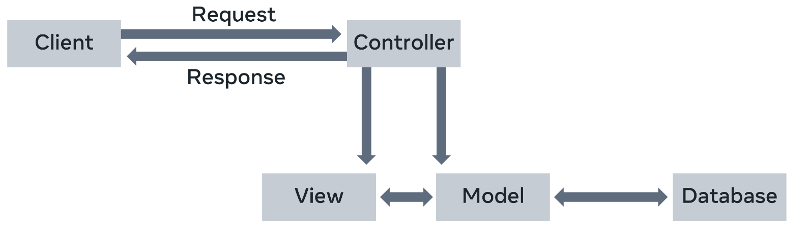

- [Quizzes](#quizzes)
  - [Module 1](#module-1)
    - [Knowledge check: Projects and Apps](#knowledge-check-projects-and-apps)
    - [Knowledge check: Applications](#knowledge-check-applications)
    - [Knowledge check: Web Frameworks and MVT](#knowledge-check-web-frameworks-and-mvt)
    - [Module Quiz: Introduction to Django](#module-quiz-introduction-to-django)
  - [Module 2](#module-2)
    - [Knowledge check: Views](#knowledge-check-views)
    - [Knowledge check: Requests and URLs](#knowledge-check-requests-and-urls)
    - [Knowledge check: Handle errors in Views](#knowledge-check-handle-errors-in-views)
    - [Module Quiz: Views](#module-quiz-views)
  - [Module 3](#module-3)
    - [Knowledge Check: Models \& Migrations](#knowledge-check-models--migrations)
    - [Knowledge Check: Model and Forms](#knowledge-check-model-and-forms)
    - [Knowledge Check: Admin](#knowledge-check-admin)
    - [Knowledge Check: Database Configuration](#knowledge-check-database-configuration)
    - [Module Quiz: Models](#module-quiz-models)
  - [Module 4](#module-4)
    - [Knowledge check: Templates](#knowledge-check-templates)
    - [Knowledge check: Working with Templates](#knowledge-check-working-with-templates)
    - [Module Quiz: Templates](#module-quiz-templates)
- [MVT Overview](#mvt-overview)
  - [Web Framework](#web-framework)
  - [MVC Architecture](#mvc-architecture)
  - [MVT Architecture](#mvt-architecture)
    - [URL dispatcher](#url-dispatcher)
    - [View](#view)
    - [Model](#model)
    - [Template](#template)
- [View logic](#view-logic)
  - [What does the view do?](#what-does-the-view-do)
    - [GET and POST methods](#get-and-post-methods)
    - [View rendering template](#view-rendering-template)
    - [Class based views](#class-based-views)
    - [Generic views](#generic-views)
- [Request and Response Objects](#request-and-response-objects)
    - [HttpRequest Object](#httprequest-object)
      - [`request.method`](#requestmethod)
    - [HttpResponseObject](#httpresponseobject)
- [Parameters](#parameters)
  - [Path parameter](#path-parameter)
    - [Path converters](#path-converters)
  - [Query parameter](#query-parameter)
  - [Body parameters](#body-parameters)

# Quizzes

## Module 1

### Knowledge check: Projects and Apps


### Knowledge check: Applications


### Knowledge check: Web Frameworks and MVT


### Module Quiz: Introduction to Django


## Module 2

### Knowledge check: Views


### Knowledge check: Requests and URLs


### Knowledge check: Handle errors in Views


### Module Quiz: Views


## Module 3

### Knowledge Check: Models & Migrations


### Knowledge Check: Model and Forms


### Knowledge Check: Admin


### Knowledge Check: Database Configuration


### Module Quiz: Models


## Module 4

### Knowledge check: Templates


### Knowledge check: Working with Templates


### Module Quiz: Templates


# MVT Overview

## Web Framework

A software framework, in general, is a standard, reusable software platform that facilitates the rapid development of software applications.

The web framework (also called web application framework) provides a generic functionality needed for building web applications, APIs and web services.

The main advantage of employing a web framework for development is that it provides "out of the box" support to perform everyday operations in the web development process.

For example, you can easily connect your application to databases. Usually, the framework handles tasks such as session management much more efficiently.

Likewise, it integrates with templating tools to render dynamic content on web pages.

## MVC Architecture

Most of the web frameworks implement the MVC (Model-View-Controller) architecture.

The MVC design pattern separates the entire web application development process into three layers, Model, View and Controller.

The following diagram explains the interplay of these three layers.



In the MVC approach, the controller intercepts the user requests.

It coordinates with the view and model layers to send the appropriate response back to the client.

The model is responsible for data definitions, processing logic and interaction with the backend database.

The view is the presentation layer of the application.

It takes care of the placement and formatting of the result and sends it to the controller, which in turn, redirects it to the client as the application's response.

## MVT Architecture

The Django framework adapts a Model, View and Template (MVT) approach, a slight variation of the MVC approach.

Here too, the model is the data layer of the application. The view is, in fact, the layer that undertakes the processing logic.

The template is the presentation layer.


A Django application consists of the following components:

- URL dispatcher

- View

- Model

- Template

### URL dispatcher

Django's URL dispatcher mechanism is equivalent to the controller in the MVC architecture.

The `urls.py` module in the Django project's package folder acts as the dispatcher.

It defines the URL patterns. Each URL pattern is mapped with a view function to be invoked when the client's request URL is found to be matching with it.

The URL patterns defined in each app under the project are also included. Here’s the `urls.py` file in the app folder.

```python
from django.urls import path
from . import views

urlpatterns = [
    path('', views.index, name='index'),
]
```

When the server receives a request in the client URL, the dispatcher matches its pattern with the patterns available in the `urls.py`.

It then routes the flow of the application toward its associated view.

### View

The view function reads the path, query, and body parameters included in the client's request If required, it uses this data to interact with the models to perform CRUD operations.

A view can be a user-defined function or a class.

You create View definitions in the `views.py` file of the respective app package folder.

The following code in the `view.py` file defines the `index()` view function.

```python
from django.shortcuts import render
# Create your views here.
from django.http import HttpResponse

def index(request):
    return HttpResponse("Hello, world.")
```

### Model

A model is a Python class.

An app may have one or more model classes, conventionally put in the `models.py` file.

Django migrates the attributes of the model class to construct a database table of a matching structure.

Django's Object Relational Mapper helps perform CRUD operations in an object-oriented way instead of invoking SQL queries.

The view uses the client's and the model's data and renders its response using a template.

### Template

A template is a web page containing a mix of static HTML and Django Template Language code blocks.

You place Template web pages in `the templates` folder with the `.html` extension.

Django's template processor uses any context data from the view inserted in these blocks to formulate a dynamic response.

The view, in turn, returns the response to the user.

This explains how Django's MVT architecture handles the request-response cycle in a web application.

# View logic

The view plays a pivotal role in Django's MVT architecture. On one side, Django's URL dispatcher invokes a corresponding view function that matches the URL pattern.

On the other side, the view interacts with both the model and template layers.

## What does the view do?

The primary role of the view function is to fetch the data from the client's request, apply a certain processing logic to it and send an appropriate response back to the client.

It receives the request data in an object of class `HttpRequest`.

For simplicity, you can say models are equivalent of a database in Django. The view function interacts with the model in either of two ways. It either fetches all or certain objects from the model such as the database table mapped with the model.

Or the request parameters are used to add a new instance of the model thereby inserting a new row in the mapped table.

The client uses the HTTP GET method to provide the data from the model or delete a certain instance.
On the other hand, it uses the POST method to indicate that the data in the request is to be used to perform an insert or update operation.

While you will learn about models soon, it is good to know the fundamentals. In the upcoming modules of this course, you’ll learn how to perform these model operations.

### GET and POST methods

Schematically, this behavior is implemented as below:

```python
from django.shortcuts import render

def myview(request):

  if request.method=='GET':
      #perform read or delete operation on the model

  if request.method=='POST':
      #perform insert or update operation on the model
```

```python
from django.shortcuts import render

def myview(request):
    if request.method=='GET':
        val = request.GET['key']
        #perform read or delete operation on the model
    if request.method=='POST':
        val = request.POST['key']
        #perform insert or update operation on the model
```

At the end of performing any process, you would want to let the user know about the result.

The return value of the view function is a `HttpResponse` object containing the actual contents of default content_type as **“text/HTML”** and the status code.

Additionally, it contains some header information. However, you would also want the view to give a well-formatted response.

Since the web browser is the client of your web application, the response should be in HTML format as a web page, called a web template.

The Django view loads the template web page, inserts certain context data at the placeholders marked with tags, and returns it as the response.

### View rendering template

```python
from django.shortcuts import render

def myview(request):

      if request.method=='GET':
            #perform read or delete operation on the model

      if request.method=='POST':
            #perform insert or update operation on the model
            context={ } #dict containing data to be sent to the client

      return render(request, 'mytemplate.html', context)
```

### Class based views

In the above discussion, **myview** is a regular Python function.

Such views are called **function based views**. The processing logic in it is very imperative in nature, hence it may be repetitive.

Also, it uses conditional blocks for GET and POST requests. Django offers a more concise alternative in the form of a class-based view.

You create a sub-class of the View class and override its **get()** and **post()** methods to separately and cleanly define GET and POST operations.

```python
from django.views import View
class MyView(View):
    def get(self, request):
        # logic to process GET request
        return HttpResponse('response to GET request')

    def post(self, request):
        # <logic to process POST request>
        return HttpResponse('response to POST request')
```

### Generic views

Django makes the view declaration process still easier with its generic class-based views. The `django.views.generic` module contains several view classes that provide the functionality required to perform tasks such as rendering a template, showing an instance, showing the list of instances, adding a new model instance, updating an instance and so on.

Some generic views are `TemplateView, CreateView, ListView, DetailView, UpdateView` to name a few.

You need to subclass the generic view and set the properties like `model` and `template_name`. Django will internally perform all the heavy lifting which you had to do by yourself in a function-based view.

# Request and Response Objects

A web application works on the principle of a request-response cycle in a client-server architecture, following the HTTP protocol.

Generally, a browser sends the request in the form of a URL. The web application forms a suitable response to the data contained in the request.

This Reading will provide more detailed information on the Request and Response Objects.

Django handles the request and response with the help of **HttpRequest** and **HttpResponse** classes in the **django.http** module.

Django obtains the **HttpRequest** object from the context provided by the server.

As a client request is received, Django’s URL dispatcher mechanism invokes a view that matches the URL pattern and passes this **HTTPRequest** object as the first argument so that all the request metadata is available to the view for processing.

### HttpRequest Object

The request object is characterized by its attributes and methods. They are used extensively in the processing logic of a Django view.

#### `request.method`

The view logic uses this attribute to identify how the client has approached the server. A browser submits its request using any HTTP methods or verbs – `POST, GET, DELETE, and PUT`.

Inside the view function, different conditional blocks may be executed depending on the value of the method attribute. For example:

```python
if request.method == 'GET':
    do_something()
elif request.method == 'POST':
    do_something_else()
```

According to the **REST**(Representational State Transfer) principle, the **POST** method creates a new resource on the server.

To fetch one or more resources from the server, the **GET** method is used. Similarly, the **PUT** method is for updating an existing resource, and the **DELETE** method is used to remove a resource from the server.

- `request.GET and request.POST`

The attributes return a dictionary-like object containing GET and POST parameters, respectively.

- `request.COOKIES`

Along with the parameters, the browser also packs the request objects with cookies inserted by the server’s previous interactions. It is a dictionary of string keys and values.

- `request.FILES`

When the user uploads one or more files with a multipart form, they are present in this attribute in the form of UploadedFile objects. By appropriate logic in the view, these uploaded files are saved in the designated folder on the server.

- `request.user`

The request object also contains information about the current user. This attribute is an object of **django.contrib.auth.models.User** class. However, if the user is unauthenticated, it returns **AnonymousUser**. Inside the view, you can lay down separated separate logic for either of them.

```python
if request.user.is_authenticated():
    # Do something for logged-in users.
else:
    # Do something for anonymous users.
```

- `request.has_key()`

This is a method available to the request object. It helps check whether the **GET** or **POST** parameter dictionary has a value for the given key.

Unlike the **HttpRequest** object, which is supplied by the server’s context, the response object of **HttpResponse** class is instantiated inside the view function before it is returned to the client. For example:

```python
from django.http import HttpResponse
def index(request):
    return HttpResponse("Hello World")
```

Although it is possible to render a hardcoded HTML string as the response, Django offers a better alternative to render a template web page.

```python
from django.http import HttpResponse
from django.template import loader
def index(request):
    template = loader.get_template('demoapp/index.html')
    context={}
    return HttpResponse(template.render(context, request))
```

You can pack additional headers or cookies in the response object.

### HttpResponseObject

Some of the main attributes and methods of the **HttpResponse** object are:

- `status_code`: returns the HTTP status code corresponding to the response

- `content`: returns the byte string of the response.

- `__getitem__()`: method that returns the value of a header

- `__setitem__()`: method used to add a header

- `write()`: This method creates a file-like object.

The following example demonstrates the attributes of the request and response objects. Add the following view function in `views.py` of the Django app.

```python
from django.http import HttpResponse
def index(request):
    path = request.path
    method = request.method
    content='''
<center><h2>Testing Django Request Response Objects</h2>
<p>Request path : " {}</p>
<p>Request Method :{}</p></center>
'''.format(path, method)
    return HttpResponse(content)
```

# Parameters

In this reading, you’ll explore the different options for using parameters in a web application and showcase how they are related to the GET, PUT, POST and DELETE operations.

You’ll familiarize yourself with the differences between path, query, and body params and how they're associated with HTTP methods such as GET, PUT, POST and DELETE.

The view function in Django is like any other Python function in that it receives its mandatory argument as the request object from the server context. The client may pass additional arguments via different methods.

## Path parameter

The client browser sends data along with the URL itself. For example, a URL such as http://example.com/customer/5. Here, the URL endpoint id, `/customer/5`, is the variable parameter (this can be any other number).

The parameter linked to the URL’s endpoint is called a `path` parameter. Note that there may be multiple path parameters in the URL, separated by / symbol.

For now, consider that the browser will use the URL http://localhost:8000/getuser/John/1

The URL dispatcher should identify John as the **name** parameter and 1 as the **id** parameter.

This pattern is mapped to the **pathview()** function with the following path in the URL patterns list in the app’s **url.py** file.

```python
path('getuser/<name>/<id>', views.pathview, name='pathview'),
```

Next, add the `pathview()` function in `views.py` file.

```python
from django.http import HttpResponse
def pathview(request, name, id):
    return HttpResponse("Name:{} UserID:{}".format(name, id))
```

As a result, the parameters in the above URL are parsed as name and id parameters and picked by the `pathview()` function, returning the displayed response.

An important thing to understand here is the parameters added inside the `path()` function in the `urls.py` file must match the arguments added inside the `pathview()` view function associated with it in the `views.py` file.

### Path converters

The URL pattern treats the identifiers in angular brackets (`<..>`) as the path parameters. By default, it parses the received value to the string type. Other path converters available are:

- `str` - Matches any non-empty string and excludes the path separator, '/'. This is the default if a converter isn’t included in the expression.

- `int` - Matches zero or any positive integer and returns an `int`. For example:`/customer/<int:id>`

- `slug` - Matches any slug string consisting of ASCII letters or numbers, including the hyphen and underscore characters.

- `uuid` - Matches a formatted UUID. For example: `075194d3-6885-417e-a8a8-6c931e272f00` and returns a UUID instance.

- `path` - Matches any non-empty string and includes the path separator, '/'.

## Query parameter

The client URL may contain a query string linked to the endpoint, for example, http://localhost:8000/getuser/?name=John&id=1

A query string is a sequence of one or more **key=value** pairs concatenated by the **&** symbol. Each key is the query parameter. The query string ends with the ? symbol after the URL endpoint.

**Query strings are an alternative approach to URL parameters for adding URL configurations.**

The URL dispatcher doesn’t parse these parameters. They are fetched by the view from the request object it receives. The request object’s `GET` property is a dictionary object.

The key-value pairs in the query string are added to the `request.GET` property. Hence, the name can be obtained with `request.GET[‘name’]` expression.

The next step is to add the following path in the `urls.py` file:

```python
path('getuser/', views.qryview, name='qryview')
```

Declare the **qryview** function in the `views.py` file.

```python
def qryview(request):
    name = request.GET['name']
    id = request.GET['id']
    return HttpResponse("Name:{} UserID:{}".format(name, id))
```

Now, start the server and use `http://localhost:8000/myapp/?name=John&id=1` as the URL. The client gets back the response shown above.

## Body parameters

An HTML form sends the data to the URL mentioned in its action attribute using the POST method. The POST method is a more secure way of sending data than the GET method because the data is not revealed in the URL.

Let’s construct a simple form containing two text input elements. Then, save it as `form.html` in the `templates` folder.

```python
<form action="/myapp/getform/" method="POST">
    
    <p>Name: <input type="text" name="id"></p>
    <p>UserID :<input type="name" name="name"></p>
    <input type="submit">
</form>
```

The `` tag is necessary to prevent cross-site forgery attacks. You’ll learn more about this later on in the course.

Next, you’ll need to provide a view that will render this form:

```python
def showform(request):
    return render(request, "form.html")
```

The URL patterns list must be updated using the following path:

```python
path("showform/", views.showform, name="showform"),
```

The `http://localhost:8000/myapp/showform/` URL displays this form to the user


When this is submitted, it goes to the http://localhost:8000/myapp/getform/ URL. Now, map it to `getform()` function in the `urls.py` file.

```python
path("getform/", views.getform, name='getform'),
```

The form data that the user posts becomes part of the request body.

Therefore, the name attribute of each form element becomes a body parameter and the data entered becomes its value.

The view function passes these body parameters from the **request.POST** dictionary-like attribute.

```python
def getform(request):
    if request.method == "POST":
        id=request.POST['id']
        name=request.POST['name']
    return HttpResponse("Name:{} UserID:{}".format(name, id))
```

Complete the form and submit it. The **getform()** function returns the data as its response.


