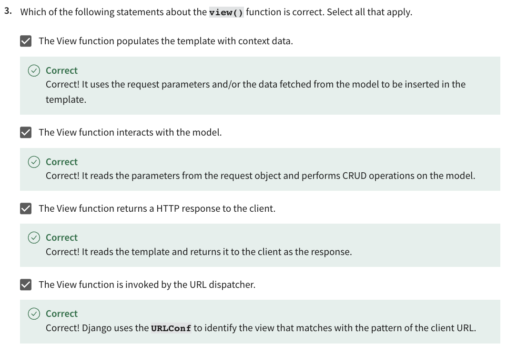
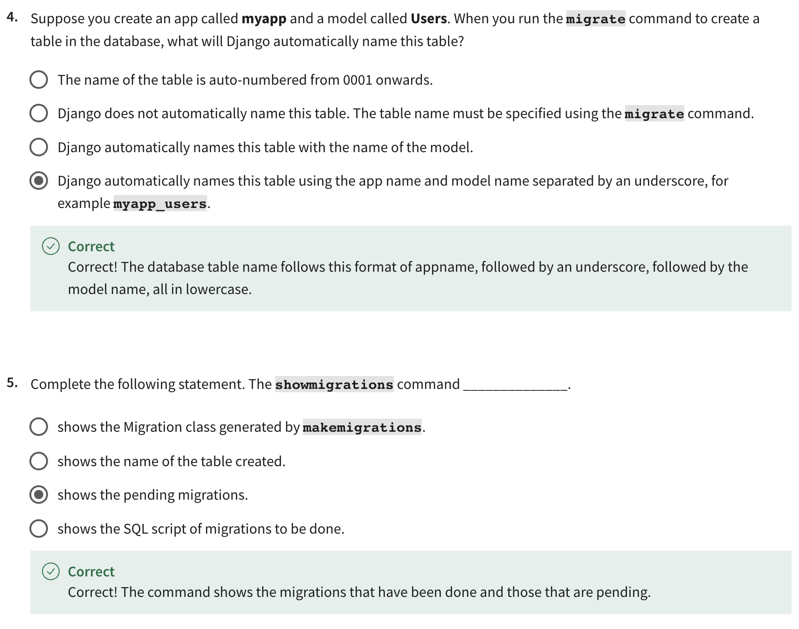

- [Quizzes](#quizzes)
  - [Module 1](#module-1)
    - [Knowledge check: Projects and Apps](#knowledge-check-projects-and-apps)
    - [Knowledge check: Applications](#knowledge-check-applications)
    - [Knowledge check: Web Frameworks and MVT](#knowledge-check-web-frameworks-and-mvt)
    - [Module Quiz: Introduction to Django](#module-quiz-introduction-to-django)
  - [Module 2](#module-2)
    - [Knowledge check: Views](#knowledge-check-views)
    - [Knowledge check: Requests and URLs](#knowledge-check-requests-and-urls)
    - [Knowledge check: Handle errors in Views](#knowledge-check-handle-errors-in-views)
    - [Module Quiz: Views](#module-quiz-views)
  - [Module 3](#module-3)
    - [Knowledge Check: Models \& Migrations](#knowledge-check-models--migrations)
    - [Knowledge Check: Model and Forms](#knowledge-check-model-and-forms)
    - [Knowledge Check: Admin](#knowledge-check-admin)
    - [Knowledge Check: Database Configuration](#knowledge-check-database-configuration)
    - [Module Quiz: Models](#module-quiz-models)
  - [Module 4](#module-4)
    - [Knowledge check: Templates](#knowledge-check-templates)
    - [Knowledge check: Working with Templates](#knowledge-check-working-with-templates)
    - [Module Quiz: Templates](#module-quiz-templates)

# Quizzes

## Module 1

### Knowledge check: Projects and Apps

### Knowledge check: Applications

### Knowledge check: Web Frameworks and MVT

### Module Quiz: Introduction to Django

## Module 2

### Knowledge check: Views

### Knowledge check: Requests and URLs

### Knowledge check: Handle errors in Views

### Module Quiz: Views

## Module 3

### Knowledge Check: Models & Migrations

### Knowledge Check: Model and Forms

### Knowledge Check: Admin

### Knowledge Check: Database Configuration

### Module Quiz: Models

## Module 4

### Knowledge check: Templates

### Knowledge check: Working with Templates

### Module Quiz: Templates

